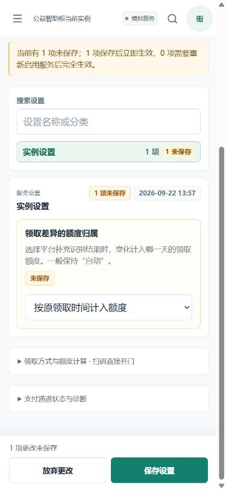
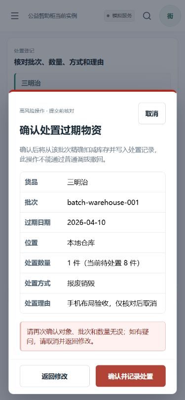
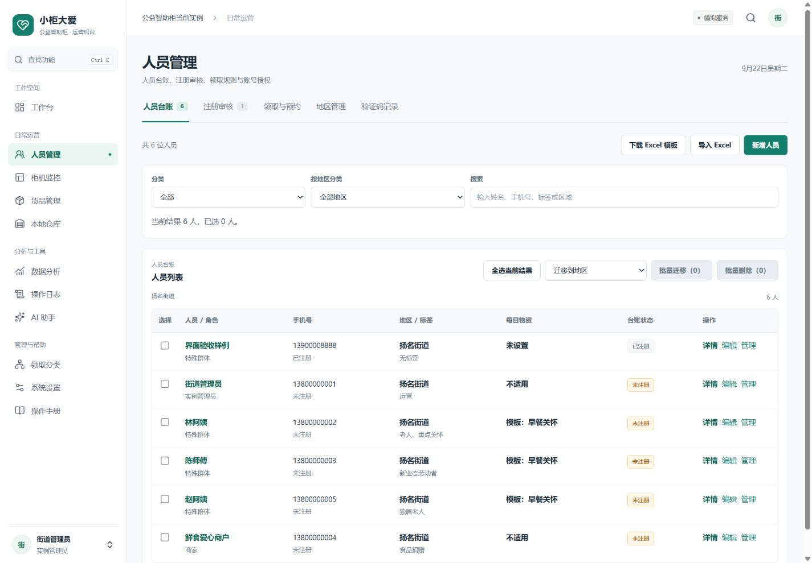

# 后台手机布局验收

2026-09-22，继续在 `codex/admin-workspace-redesign` 上迭代，基于本轮开始时的 `a9bb55c`。范围是手机浏览器中的管理后台，使用本地演示实例的管理员会话；没有推送或部署。

结论：需要单独适配。首版解决了整页溢出，但人员操作仍藏在宽表格右侧，货品固定操作列占据手机的大部分宽度，柜机的两列表格也被通用最小宽度撑开。手机不能只靠缩小桌面布局来使用这些功能。

## 发现与修复

| 观察到的问题 | 当前实现 | 证据 |
| --- | --- | --- |
| 人员表格看得到姓名，但编辑和管理需要横滑 | 800px 及以下改为字段卡片，详情、编辑、管理完整展示，展开管理仍在当前人员下方 | [修复前](mobile/03-before-users-table-375.png)、[卡片](mobile/14-after-user-card-375.png)、[展开管理](mobile/15-after-user-management-375.png) |
| 货品固定操作列遮住中间字段，卡片化后原容器仍产生双层滚动 | 货品台账与库存分布使用卡片；保留全部字段和操作，取消这些卡片容器的内部滚动 | [修复前](mobile/06-before-goods-table-375.png)、[修复后](mobile/18-after-goods-card-390.png) |
| 柜机列表两列被撑宽，在线状态、库存数字被挤出视野 | 两列表格按实际容器宽度排版；状态、门状态与数量同时可见 | [修复前](mobile/21-operations-430.png)、[修复后](mobile/22-after-operations-430.png) |
| 柜机详情状态区过长，库存的到期提示和操作在表格右侧 | 状态区使用两列，库存卡片保留分类、数量、今日变化、到期提示和原操作 | [库存与到期提示](mobile/28-after-device-inventory-430.png) |
| 仓库批次、处置入口及日志状态和详情需要横滑 | 仓库库存、过期队列、日志使用同一套有字段名称的卡片规则 | [仓库](mobile/10-after-warehouse-375.png)、[320px 日志](mobile/31-logs-card-320.png) |
| 分区超过屏幕宽度，后几个入口容易漏看 | 窄屏使用原生分区选择器，选项来自同一份权限与分区定义；URL、后退和前进仍有效 | [工作台与分区](mobile/37-dashboard-375.png) |
| 小输入框、短屏编辑和确认弹窗不方便操作 | 输入框 16px 字号、44px 高度；常用操作加大触控区域；编辑头部保持可见；弹层打开时停止背景滚动 | [短屏表单](mobile/17-after-user-form-short.png)、[短屏搜索](mobile/35-search-short.png) |
| 设置修改后必须返回顶部才能保存 | 未保存时将原来的保存、放弃按钮移到手机底部，预留内容空间；继续复用原有保存和离开保护 | [保存栏](mobile/19-after-settings-save-390.png)、[320px 离开确认](mobile/20-after-settings-leave-320.png) |
| 窄屏确认信息过高，最终按钮需要长距离滚动；320px 日期筛选溢出 | 确认摘要改为标签与值并排，底部操作固定在弹窗内；日志日期筛选在 400px 以下改为单列 | [正常高度确认](mobile/12-after-disposition-dialog-375.png)、[500px 短屏确认](mobile/36-confirmation-short.png) |

人员批量工具在手机上按选择状态展开，未选择时显示提示；桌面保留原表格和完整工具栏。这些布局没有复制 API 请求、权限判定或写操作处理函数。

## 实际走查步骤

1. **导航与分区：通过。** 320px 打开导航抽屉并进入日志；短屏搜索“过期处置”直达对应分区。人员筛选并勾选后切换分区、后退，关键词和选择均保留。
2. **主要列表：通过。** 检查人员、货品、仓库、柜机及日志；人员“管理”可展开，柜机详情的库存和到期信息完整显示。测试宽度下没有整页水平溢出；已转换的主要列表无需横滑找操作。
3. **表单、设置与确认：通过。** 打开人员编辑/新增表单，短屏滚动至末尾，关闭按钮仍可用。修改设置草稿后核对底部按钮、搜索离开确认，再选择“不保存”。过期处置填写测试理由后只打开核对框，最后“返回修改”，未执行处置。
4. **断点与回归：通过。** 检查 320×740、375×812、390×844、430×932；额外检查 320×500、375×500 短屏，以及 768×1024 平板、1440×1000 桌面。保存的尺寸记录包含发现问题时的中间结果及其修复后结果：[viewport-checks.json](mobile/viewport-checks.json)。

本轮浏览器未提交人员、设置、库存等写操作，控制台没有记录到错误。屏幕内所有姓名和业务数据来自隔离演示环境。

## 自动检查

- 后台类型检查通过。
- 61 项纯规则测试、38 项组件与流程测试通过，共 **99 项**。
- 新增手机分区选择器的路由、查询参数、前进后退、筛选和勾选保留检查；补充只读账号下的选项检查。
- 后台生产构建、前端安全检查、Git 补丁检查通过。
- 本轮只改前端，API 测试结果沿用前一轮记录，未把它算作本轮重新执行。

## 代表性画面

人员卡片：全部字段与操作在手机宽度内。

未保存设置：保存栏可见，正文仍可滚动。

高风险操作核对：对象、批次、数量、理由和取消/确认按钮可读。

桌面回归：保留表格、侧栏和全部批量工具。

平板使用窄屏布局：[768px 预览](mobile/34-after-tablet-goods-768.png)。

## 后续维护与验收边界

入口：[mobile.css](../../../apps/admin-web/src/styles/mobile.css)、[WorkspaceSections.vue](../../../apps/admin-web/src/components/WorkspaceSections.vue)，扩展规则见 [工作区索引](../../../WORKSPACE_INDEX.md)。新增卡片必须同时核对字段标签、长内容换行、选择和操作，不能靠隐藏列消除溢出。

这是桌面浏览器的视口测试与实际点击复验，不是物理手机测试。iOS Safari、微信内置浏览器、真实软键盘、刘海安全区以及屏幕阅读器仍需人工设备验收；500px 视口仅用于验证低高度布局，不能替代软键盘测试。复杂报表/导出预览中的对照表仍可局部横向滚动，本轮不声称后台每张表都已改为卡片，也不声称已通过完整无障碍认证。
