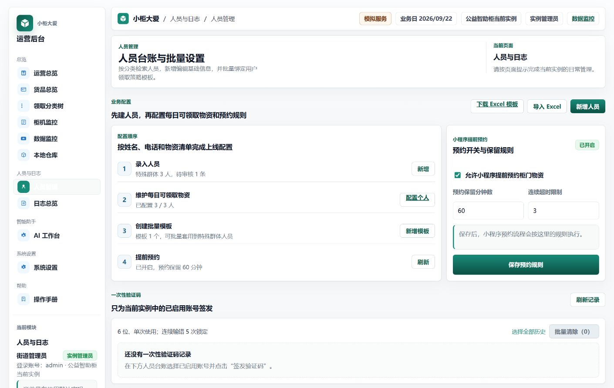
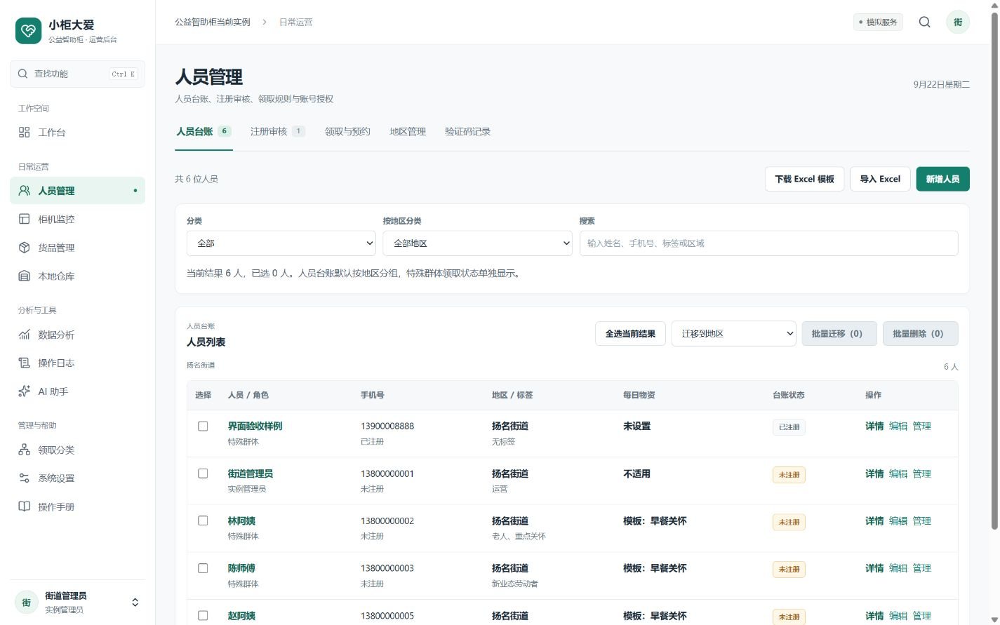
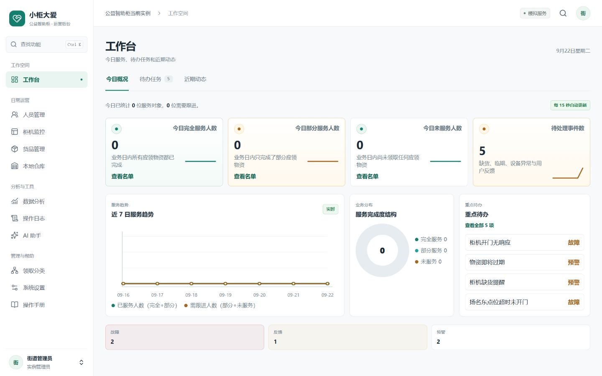

# 后台工作空间重构 · 评审与发布记录

2026-09-22 完成首轮实现、浏览器初验和发布准备。2026-09-23 用户授权在回滚有备案的条件下上线，现已发布 `48650d2`，公网与正式会话验收通过，详见 [正式发布与回滚回执](DEPLOYMENT_20260923.md)。

后续交互检查与测试结果见 [流程回归记录](REGRESSION.md)；手机和平板的适配结果见 [手机布局验收](MOBILE.md)；[发布准备与交接](RELEASE_READINESS.md) 保留上线前的检查快照；修改入口见根目录 [工作区索引](../../../WORKSPACE_INDEX.md)。下文保留首轮本地视觉验收记录，不替代最新发布回执。

## 评审入口与后续工作位置

- 预览：<http://127.0.0.1:5188/>，演示账号 `admin` / `admin`。
- 分支：`codex/admin-workspace-redesign`。
- 基线：`vending/codex/UI`，提交 `d9f38423cae7ab5cc383c53f6bc4042d7be192f9`。
- 工作树：`C:\Users\LEGION\.codex\worktrees\admin-workspace-redesign\vending machine`。
- 后续修改继续在这个分支和工作树进行。原项目目录中的未提交修改没有被移入或覆盖。

预览使用独立模拟数据，API 仅监听 `127.0.0.1:4188`，前端仅监听 `127.0.0.1:5188`。演示数据保存在本工作树的 `.codex-run/admin-redesign-preview/`，不提交到 Git。界面中的姓名、手机号、柜机及库存均来自演示数据；浏览器验收新增了一条“界面验收样例”。历史种子记录集中在 4 月，所以当天服务人数为零，不能据此推断线上运营状态。

若预览进程已退出，在此工作树执行：

```powershell
npm ci --ignore-scripts
node scripts/preview-admin-redesign.mjs
```

此脚本清除继承的部署配置，使用模拟支付和模拟验证码。不要将演示账号或此启动脚本用于公网部署。

## 设计参考与取舍

参考 [Tabler](https://tabler.io/admin-template) 的侧栏、工作区和表格组织，以及 [Ant Design 导航规范](https://ant.design/docs/spec/navigation/) 对位置感、导航层级和一致性的要求。落地保留项目的绿色品牌、Vue 3 和现有业务组件；没有引入另一套后台框架或替换业务接口。

本轮把“进入一个模块就展开全部功能”改为“先看到常用任务，再进入明确命名的分区”。导航、搜索、分区共用定义；分区写入 URL，支持刷新、浏览器后退和直接链接。切换分区保留本页表单与选择状态；切换页面或分区会回到页首，浏览器后退恢复原滚动位置。

| 模块 | 现在的入口 | 保留的重要操作 |
| --- | --- | --- |
| 工作台 | 今日概况 / 待办任务 / 近期动态 | 服务名单、任务详情、处理、AI 分析、关联柜机和人员 |
| 人员管理 | 人员台账 / 注册审核 / 领取与预约 / 地区管理 / 验证码记录 | 新增、编辑、Excel 导入导出模板、批量迁移删除、模板绑定、后台授权、柜机分配、验证码 |
| 人员详情 | 人员概况 / 领取规则 / 活动记录 / 结算与纠错 | 分类额度、每日物资、模板、日历、预约、补记和库存纠错 |
| 货品管理 | 货品台账 / 库存与预警 / 库存调拨 | 平台同步、编辑、阈值、预警模板、分布、调拨、Excel 导出 |
| 本地仓库 | 库存台账 / 上架与盘点 / 过期处置 / 出入库记录 | 批次选择、上架、盘点、处置确认、记录导出 |
| 柜机详情 | 库存与领取 / 柜机管理 / 开柜与结算 / 操作日志 / 平台联调 | 原有权限控制、远程开门分步确认、位置维护、关联事件与日志 |
| 系统设置 | 设置目录和表单优先，解释和诊断按需展开 | 搜索、保存、放弃更改、离开保护、重启提示 |
| AI 助手 | 六类分析任务；连接详情按需展开 | 模型配置、测试、各类分析、历史结果和关联入口 |
| 日志、分类、手册 | 原 URL 和业务入口 | 原有筛选、追溯、撤销授权、分类维护、按角色帮助 |

人员表格由 10 列收敛为 7 列，后台账号、柜机分配与验证码操作放入每行“管理”。在相同 1440 像素视口下，人员表格顶部从约 1714px 提前到约 515px。业务功能没有靠删除来实现页面缩短。

## 初验结果与截图

下表记录本轮实际操作和观察；“通过”只覆盖所列范围。截图均取自本轮本地运行页面，已查看实际图像，错误尺寸和中间版本截图不作为最终证据。

| 步骤 | 操作与观察 | 结果 | 证据 |
| --- | --- | --- | --- |
| 1. 导航与检索 | 11 个管理员模块可进入；搜索“调拨”能打开具体分区；无结果提示正常；Esc 关闭后焦点回到搜索按钮 | 通过 | [功能检索](09-function-search.png) |
| 2. 工作台 | 今日概况、任务池切换；详情抽屉打开关闭；任务表按钮没有遮挡；零人数圆环为空态；折线日期对齐 | 通过 | [概况](04-dashboard-desktop.png)、[任务池](05-dashboard-tasks.png)、[详情](06-task-detail.png) |
| 3. 人员工作流 | 按姓名筛选；选择人员、展开管理、切换规则后选择仍保留；审核分区可达；本地新增演示人员成功，列表显示成功状态 | 通过 | [人员列表](07-users-desktop.png)、[审核](08-registration-review.png)、[手机审核](22-registration-mobile.png) |
| 4. 物资与仓库 | 调拨来源、目的地、批次、数量和说明可见；仓库四分区可达；过期队列角标与本地仓库批次一致；无可用批次时不能提交 | 通过；未提交调拨或处置 | [调拨](10-goods-transfer.png)、[仓库](11-warehouse-desktop.png) |
| 5. 人员与柜机详情 | 人员规则、活动与纠错入口可达，分区刷新保留；柜机状态、管理、事件入口可达；远程开门原因为空不能继续，取消可返回 | 通过界面初验；未发送开门请求 | [柜机监控](13-operations-desktop.png)、[开门确认](15-device-confirmation.png) |
| 6. 设置与工具 | 修改设置后离开触发未保存提示，选择“不保存”可离开；未配置选择框显示明确文案；日志、AI、分类、数据分析、手册可进入 | 通过；AI 服务未配置，未执行生成 | [设置](16-settings-desktop.png)、[日志](26-logs-desktop.png)、[AI](27-ai-desktop.png)、[分类](28-taxonomy-desktop.png)、[手册](29-manual-desktop.png) |
| 7. 响应式 | 实测 1440×900、1024×900、768×1024、375×812；检查工作台、人员、规则、货品等主要页面；小屏导航使用抽屉，分区和宽表格独立滚动 | 已测页面无整体水平溢出 | [1024 工作台](17-dashboard-1024.png)、[375 工作台](18-dashboard-mobile.png)、[375 审核](22-registration-mobile.png) |

本轮发现并修复了审核按钮纵向撑满、表单抽屉缺少内边距、任务抽屉内容被拉开、侧栏活动项可读性、窄屏统计卡过长、平板图表拥挤、折线日期错位、仓库角标统计范围、日志文字溢出等问题。在上述范围内，未发现仍阻挡主要操作的遮盖或页面溢出，已达到人工评审条件。

### 代表性画面

重构前，人员列表被大段初始化配置推到首屏以下：



重构后，人员列表和常用操作优先：



工作台：



手机审核保留全部处理入口：


## 自动检查与实现说明

以下检查在本分支执行通过：

```text
npm run typecheck --workspace @vm/admin-web   Vue 模板和 TypeScript 类型检查通过
npm test --workspace @vm/admin-web            61 项通过，0 失败
npm run build --workspace @vm/admin-web       构建通过
npm run smoke:frontend-safety                 前端安全检查通过
git diff --check                             通过
```

- 新增测试覆盖路由菜单匹配、无效分区回落、角色和权限筛选、受限子功能检索。
- 安全检查跟随共享导航定义与移动导航抽屉更新，继续校验权限、登出、确认流程、业务安全边界；没有删除这些保护。
- 类型检查改为 `vue-tsc`，同时检查 `.vue` 模板。修复了由此暴露的少量原有类型问题。
- 页面按路由加载，入口 JS 约 162KB，gzip 约 57KB。这里报告构建产物体积，没有宣称实际网络耗时改善。
- 浏览器最终验收标签页未记录到 console error。
- API、数据库结构、权限模型和真实设备动作没有改动。

## 人工评审重点与证据边界

建议先按“找人员 → 展开管理 → 配置领取规则”“找待办 → 查看详情”“货品 → 调拨”“仓库 → 过期处置”四条常用路径试用，再判断命名、密度和操作位置是否符合日常习惯。所有后续反馈继续在当前分支修改。

本轮不是公网发布验收。未连接真实柜机、支付、短信或 AI 服务；没有执行真实开门、退款、处置等操作。其他角色的可见性通过自动测试校验，本轮浏览器主要使用实例管理员；没有宣称完成全角色、全数据规模、全浏览器或屏幕阅读器合规测试。既有 Word 使用手册与历史示意图片不在本轮重排范围。
