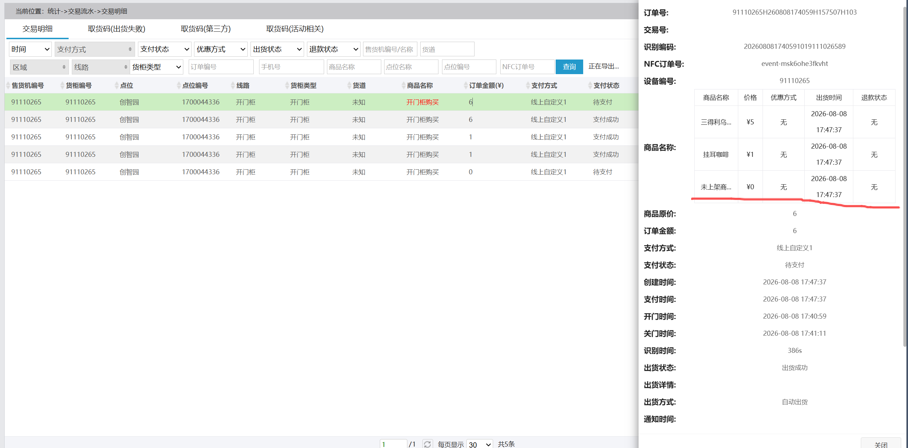

# SmartVM 结算回调缺失时的人工处理边界

## 现象

2026 年 8 月 8 日出现过一次真实案例：柜机平台在关门后生成了订单并给出了识别结果，但业务后台只收到开门、关门状态，没有收到结算或差额调整回调。对应领取事件因此保持“门已关、待结算”，无法从现有回调判断这是空开门、识别异常，还是平台结算回调超时。

## 当前处理方式

- 由实例管理员核对柜机平台订单后，通过人工补扣或人工对账完成处理。
- 不根据开门、关门状态自动推断领取商品和数量。
- 不因平台已显示订单就自动标记支付成功；只有收到可信结算回调，或经过受控人工核对，才能结束业务事件。
- 不把“未收到结算回调”直接解释为空开门，以免错误扣减用户额度或库存。

## 后续改进方向

可增加“等待平台结算”中间态。超过等待时间后，由有权限的管理员录入平台订单号、实际商品、数量和处理依据，再通过具备幂等校验与审计记录的人工完成入口结案。该入口应拒绝重复处理，并保留原始事件、平台订单和人工调整之间的关联。

在该能力完成前，本案例保持人工处理，不扩大自动回写范围，也不修改小程序端流程。
