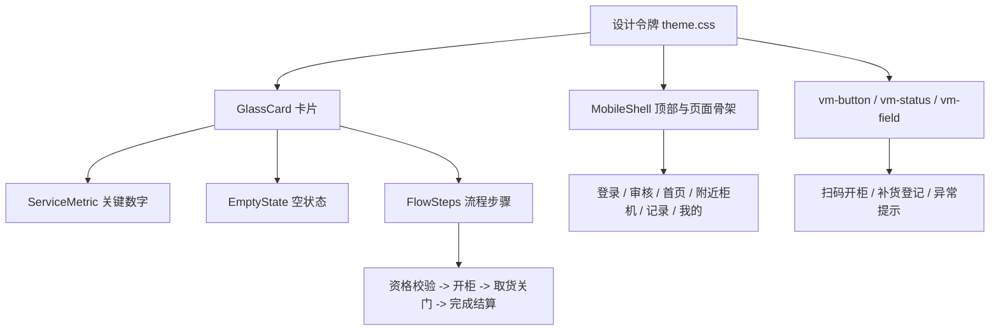

# 小柜大爱移动端暖心公益卡片风设计稿

## 设计方向

- 主色：柔和绿色 `#2E7D46`，代表可信、希望和公益。
- 强调色：暖橙色 `#FF8A2B`，用于扫码开柜、补货开门、低库存和提醒。
- 背景：米白 `#FFF7EC`，页面保持轻量、亲切、低压。
- 组件：圆角卡片、轻阴影、统一标签、统一表单高度、简洁线性图标。
- 文案：短句优先，突出状态、关键数字和下一步动作。

## 页面稿

### 登录 / 身份识别

- 首屏品牌为“小柜大爱”，配柜机插画组件 `CabinetHeroArt`。
- 主操作为“登录 / 身份识别”，次操作为“提交注册申请”和“联系工作人员”。
- 标签展示“已认证 / 审核中 / 可领取”，帮助用户理解手机号识别结果。

### 注册申请 / 审核中

- 注册页先展示“提交资料 / 等待审核 / 审核通过后登录”流程标签。
- 角色文案统一为“受助用户 / 爱心商户 / 管理员”。
- 审核中页使用同一柜机插画，状态标签区分“审核中”和“需修改”。

### 受助用户首页

- 首页优先展示“今日是否可领取”“可领取次数”“已领取”“开放时段”。
- 主按钮为橙色“扫码开柜”，次按钮为绿色描边“就近找柜机”。
- 无额度、非开放时段、已用完次数时，使用明确短句说明原因和下一步。

### 附近柜机地图与列表

- 页面保留“地图 / 列表”感知结构。
- 受助用户重点看距离、可领取物资、可用库存和扫码入口。
- 商户侧文案切换为补货任务：选择在线柜机，进入补货 / 开门。
- 低库存商品显示“低库存”标签，避免过度刺眼。

### 扫码开柜流程

- 共用 `FlowSteps` 展示四步：资格校验、开柜、取货关门、完成结算。
- 开柜中页显示当前柜机、计划领取或开门类型、事件编号。
- 闭门确认页继续展示步骤，并按免费、待支付、差异、入柜登记分支提示。

### 领取结果 / 领取记录

- 结果页改为状态卡：成功、暂时无法领取、无法完成。
- 失败状态展示“原因 / 说明”和建议动作。
- 记录页标题统一为“领取记录”，商户为“补货记录”。

### 商户工作台 / 补货登记

- 商户首页展示总库存、需补货提醒、模板数量。
- 四个操作入口：开始补货、补货登记、补货记录、异常上报。
- 补货登记字段覆盖：柜机、商品模板、数量、生产日期、批次号、备注、预计到期。

### 我的 / 账户设置

- 底部第四项统一为“我的”。
- 页面标题为“我的账户”，保留账号身份、姓名、手机号、帮助中心、反馈、退出登录。

## 复用组件

| 组件 | 用途 |
| --- | --- |
| `GlassCard` | 所有圆角卡片容器，统一边框、阴影、内边距 |
| `ServiceMetric` | 首页关键数字：次数、库存、提醒、模板数 |
| `MenuIcon` | 线性图标系统：扫码、柜机、补货、记录、反馈等 |
| `CabinetHeroArt` | 登录、审核等公益氛围插画 |
| `FlowSteps` | 开柜、补货、结算等流程步骤 |
| `EmptyState` | 无额度、无记录、无模板、无柜机等空状态 |

## 底部导航

- 受助用户端：首页、附近柜机、记录、我的。
- 商户端：首页、补货、记录、我的。
- 管理员端保持四项结构：首页、柜机、记录、我的。
