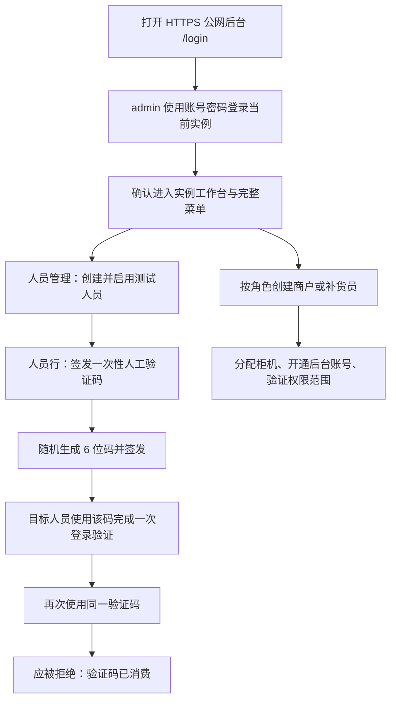

# 公益智助柜实例后台使用手册

本手册用于 Spark 上已发布的**隔离全真模拟实例**。它覆盖当前实例管理员的后台操作、人员与角色配置、随机人工验证码登录验证和常用业务功能；小程序页面的逐页验收另行进行。

## 先确认使用范围

- 从发布验收记录给出的 **HTTPS 公网入口** 打开后台；不要直接访问 Node 静态服务的裸端口。
- 当前验收使用已有的默认模拟实例。该实例的 `admin` 是实例管理员，拥有该默认实例已经开放的全部能力；它不能创建或切换其他客户实例，这是服务提供商身份的边界。不要据此推断任意新建实例或真实数据平面的账号拥有同样菜单或设置能力。
- `admin` 的首次密码只在 Spark VNC 本机终端以无回显方式初始化。密码不会写入环境变量、命令、日志或本手册。
- 电脑后台的 `admin` 登录只使用账号密码。人工验证码只供当前实例已启用人员的 APP / 小程序登录或密码重置使用，不是后台登录的第二因子。
- 当前是隔离模拟环境：柜机、支付、地图和验证码的外部行为按模拟配置运行；不得把本流程当作真实短信、真实支付或真实柜机授权。

## 一条完整的验收流程

## 1. 实例管理员登录与入口检查

1. 在浏览器打开公网入口的 `/login`。
2. 使用已初始化的 `admin` 账号密码登录。
3. 登录后确认左侧导航包含当前实例的工作区，而不是“服务商后台”。
4. 依次打开“运营主控台”“货品总览”“本地仓库”“柜机监控”“人员管理”“系统操作日志”。页面能加载且只显示当前实例数据，即表示实例会话和权限范围正确。

本节列出的完整菜单只适用于当前默认模拟实例的 `admin`：人员、后台账号、注册审核、人工验证码、柜机、货品、库存与仓库、操作日志、数据监控、AI 工作台和受控系统设置。客户实例开通与跨实例选择只属于服务提供商，不应出现在实例管理员菜单中；新建实例和真实数据平面仍按已完成租户化的功能范围关闭式开放。

## 2. 先建立人员，再建立角色账号

“人员”是业务身份；“后台账号”是登录后台的凭据。创建顺序固定如下：

1. 打开“人员管理”。
2. 新增人员，选择身份：管理员、商户、补货员或特殊群体。
3. 保存人员，确认状态为“启用”。
4. 若该人员是商户或补货员，点击“分配可管理柜机”，只勾选其职责范围内的柜机并保存。
5. 点击“后台账号权限”，选择对应后台角色并按最小权限开通账号。
6. 用该账号重新登录，确认其只能看到本角色和已分配柜机允许的页面与操作。

商户负责货品投放、补货和领取去向；补货员只处理被分配柜机；特殊群体不进入电脑后台。实例管理员负责创建、授权、审核和追溯这些账号。

## 3. 随机人工验证码：为测试人员签发一次登录码

人工验证码是实例内的临时**移动端**登录验证工具，不是第三种运营模式，也不是全局固定密码，更不用于电脑后台 `admin` 登录。

1. 在“人员管理”中找到**当前实例、已启用**的测试人员。
2. 点击该人员的“签发人工码”。
3. 用途选择“APP / 小程序登录”。
4. 页面会自动生成一个随机 6 位数字；需要时可点击“重新随机生成”。
5. 选择有效期（10 分钟、1 小时、1 天、7 天或 30 天），点击“签发一次性验证码”。长期码仍只能成功使用一次，并可随时撤销。
6. 仅通过受控渠道把这一个码交给目标人员。关闭抽屉后，后台不会再次显示明文验证码。
7. 目标人员使用该码完成一次登录验证后，到“人工验证码”记录中确认状态变为“已使用”。再次使用同一个码必须失败。

管理员还可以在有效期内撤销尚未使用的人工码。连续输错 5 次会锁定；过期、撤销、替换和已使用的码都不能恢复使用。

## 4. 按功能操作

| 功能 | 入口 | 实例管理员的检查点 |
| --- | --- | --- |
| 人员与注册审核 | 人员管理 | 只能维护当前实例人员；审核通过后人员归属当前实例。 |
| 后台账号与角色 | 人员管理 → 后台账号权限 | 角色与权限匹配；账号不能越过实例边界。 |
| 人工验证码 | 人员管理 → 签发人工码 | 随机 6 位、短期、一次性、可撤销。 |
| 柜机与权限 | 柜机监控、人员管理 → 分配可管理柜机 | 商户/补货员只能看到已分配柜机。 |
| 货品与库存 | 货品总览、本地仓库 | 货品批次、调拨、盘点和预警均在当前实例范围内。 |
| 日常运营 | 运营主控台、数据监控 | 只核对当前实例的事件、待办和统计。 |
| 审计与追溯 | 系统操作日志 | 签发、撤销和消费人工码都可追溯，但不会显示验证码明文。 |
| 系统接入设置 | 系统设置 | 只查看或维护已授权的模拟配置；不把真实密钥填入页面或文档。 |

## 5. 角色权限速查

| 角色 | 可做什么 | 不能做什么 |
| --- | --- | --- |
| 服务提供商 | 创建、查看、进入或退出客户实例；查看平台级审计 | 不以平台会话直接读取实例业务数据。 |
| 默认模拟实例管理员（`admin`） | 管理默认模拟实例的人员、账号、人工码、柜机、库存、日志和配置 | 不能创建或切换其他客户实例；不能据此推断新建实例或真实平面具有同样范围。 |
| 商户 | 处理自己的货品投放、补货模板和业务去向 | 不能查看其他商户、其他实例或未分配柜机。 |
| 补货员 | 查看并操作明确分配的柜机 | 不能管理人员、账号、人工码或未分配柜机。 |
| 特殊群体 | 在移动端完成登记、领取和记录查看 | 不进入电脑后台。 |

## 6. 验收时逐项勾选

- [ ] HTTPS 公网入口、`/login`、`/api/health` 和 `/api/public-config` 可以访问。
- [ ] `admin` 能进入默认模拟实例后台，且未获得服务提供商跨实例菜单。
- [ ] `admin` 使用账号密码进入电脑后台；人工码只用于已启用测试人员的移动端登录验证。
- [ ] 管理员能完成一项人员创建、一项后台账号配置和一项柜机分配。
- [ ] 管理员能为当前实例已启用测试人员随机签发一条 6 位登录人工码。
- [ ] 该人工码首次验证成功，重放验证被拒绝；没有发送真实短信。
- [ ] 商户和补货员分别只能看到自己的功能与柜机范围。
- [ ] 操作日志可追溯签发、撤销或消费事件，但不显示手机号或验证码明文。

## 常见问题

**“获取验证码”为什么失败？**  全真模拟的人工码模式不发送短信。请由实例管理员在“人员管理”中签发短期人工码。

**为什么找不到“签发人工码”？**  只有当前实例的管理员并且具备“签发一次性人工验证码”权限时才显示；目标人员也必须已启用并属于当前实例。

**为什么商户或补货员看不到某台柜机？**  先回到“人员管理”，为该人员分配柜机并重新登录。未分配即拒绝访问。

**为什么同一验证码第二次不能登录？**  这是单次消费保护。请重新签发一条随机人工码，旧码不能恢复。
