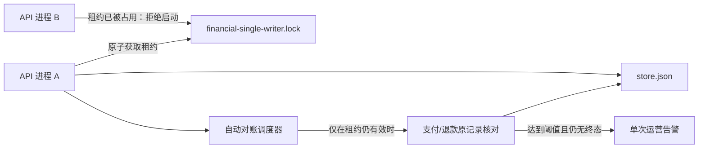
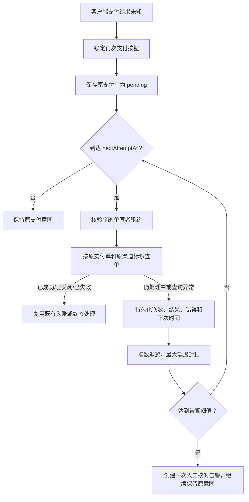

# 支付安全自动恢复与单写者运行边界

- 更新日期：2026-07-19
- 适用版本：当前本地未提交工作树
- 验证模式：`isolated-loopback-local-only`

## 结论

2026-07-18 支付安全专项审查中记录的两个 P1 问题，以及本轮并发复核继续复现的启动覆盖竞态，已在**当前 JSON 持久化阶段的受支持拓扑内**完成修复：

1. 金融写入不再只依赖单进程内互斥。API 在创建 Nest 容器和读取 Store 前先获取跨进程排他的金融单写者文件租约与随机 fencing token；第二个 API 进程不能先读旧快照后再成为写入者。
2. 真实支付和退款的长期待确认状态不再只依赖用户刷新。当前增加了持久化自动对账、指数退避、单次告警、付款人本人安全核对入口和后台恢复指标。
3. 已支付但 SmartVM 回写未完成的副作用债务会复用原交易号跨重启补偿；支付、退款和设备回写恢复任务共享有界且不饥饿的批次。
4. 支付与退款终态保持单向；渠道返回处理中或抛出“订单不存在”时，既有 `closed`、`failed` 或成功终态不会回退为待处理。

这不等于系统已经支持多实例金融写入。当前正式支持的仍是：

- 单机或单个运行目录；
- 一个 API 工作者；
- 一个金融写入者；
- JSON 业务快照和本地租约文件；
- 同一写入者内运行自动对账。

**负载均衡后的 active-active API、多台机器共享写入、数据库事务账本和分布式高可用仍是未来边界。**

本轮只在本机 `127.0.0.1`、隔离数据文件和 Mock 环境验证；没有访问公网机，没有调用真实微信、支付宝、短信或柜机，没有触发真实资金。

## 与旧报告的关系

[支付安全专项测试报告-2026-07-18.md](./支付安全专项测试报告-2026-07-18.md) 是上一轮审查时点的证据快照。其中“多实例没有金融原子性”和“长期 pending 无自动收敛”两个 P1 结论，在本轮之后应按下列口径解释：

- JSON 阶段已经可以**强制一个跨进程单写者**，并阻止误启第二个金融写入进程；
- 长期待确认已经具备**自动收敛和人工介入提示**；
- 尚未实现、也不得宣称已经实现的，是**真正的多实例事务账本**。

## 当前运行拓扑



关键约束：

- 启动顺序是“解析运行环境 → 获取金融单写者租约和 fencing token → 创建 Nest/读取 Store → 首次持久化 → 监听 HTTP”。
- 调度器和所有金融操作都必须由当前租约持有者执行。
- Store 的原子临时文件替换也必须在同一生命周期互斥与 fencing 边界内完成，旧 token 不能覆盖继任写者。
- 租约所有者变化、租约过期、文件损坏或心跳写入失败时，金融操作关闭式拒绝。
- 第二个进程不会降级成另一个可写实例，而是直接停止启动。
- 调度器不会并发重入；停止或关闭会先等待本轮任务收尾，再释放租约，避免进行中的旧任务越过继任者写入。

## 一、跨进程金融单写者

### 获取与续租

租约文件通过排他创建获取，获取、接管、心跳、受保护写入和释放由旁路 `*.lifecycle` 互斥串行化。文件记录：

- 唯一 `ownerId`；
- 高熵随机 `fencingToken`；
- 进程号和主机名；
- 获取时间；
- 最近心跳时间；
- 过期时间。

持有者定期更新心跳。每次金融操作、外部支付或 SmartVM `await` 返回后、以及 Store 落盘前，都会重新读取磁盘租约并核对 fencing token、所有者和过期时间，不能只相信进程内缓存。

### 失效处理

出现下列任一情况时，当前进程停止金融写入：

- 租约文件所有者已变化；
- 租约已经过期；
- 租约文件无法读取或无法解析；
- 心跳无法持久化；
- 心跳写入后无法证明磁盘内容仍属于当前实例。

释放租约时，只有能够证明文件仍属于当前实例才会删除；无法证明时保留现场，避免误删另一个进程的租约。

过期租约只有在确认其已过期，且同主机原进程不再存活时才会隔离并重新竞争。运维人员不应手工删除一个仍有效的租约文件来“解决启动问题”。

生命周期互斥文件 `*.lifecycle` 属于更严格的关闭式保护：如果进程恰好在获取、心跳、受保护写入或释放期间崩溃，该文件可能作为现场证据残留。当前实现**不会自动删除或接管残留的生命周期互斥文件**。这是一个高严重度的可用性残余边界，但不会降级成双写；自动按“看起来过期”删除存在检查后被新持有者替换的竞态，反而可能制造两个临界区持有者。

只有同时满足以下人工恢复条件时，才允许隔离残留的 `*.lifecycle`：

1. 已停止所有使用同一 `API_DATA_FILE`、租约文件和运行目录的 API、初始化、清空、备份与恢复进程，并阻止服务管理器自动拉起。
2. 已核对互斥文件中的主机名和 PID；确认记录进程已退出，并排除 PID 已被其他相关进程复用。主机未知、文件损坏或无法核实时继续保持关闭式阻断。
3. 从确认全部相关进程停止开始，至少等待一个完整的 `FINANCIAL_SINGLE_WRITER_LEASE_MS`，并确认主租约的 `expiresAt` 已过期。
4. 先复制保存 `*.lifecycle`、主租约、`store.json`、系统审计日志和相关控制台日志；不要直接删除证据。
5. 在仍保持全部服务停止的状态下，把 `*.lifecycle` 原子改名到带时间戳的人工隔离路径；不要改写主租约内容。
6. 只启动一个 API 实例，确认它按正常规则隔离已过期主租约、取得新 fencing token，并通过数据校验后再恢复业务。

在上述任一条件不成立时，不得为恢复可用性而绕过该保护。

### 生产门禁

JSON 账本阶段的生产配置必须满足：

```env
PAYMENT_MODE=real
FINANCIAL_SINGLE_WRITER_ENABLED=true
PAYMENT_RECONCILIATION_ENABLED=true
WEB_CONCURRENCY=1
API_INSTANCE_COUNT=1
NODE_APP_INSTANCE=0
```

说明：

- `WEB_CONCURRENCY`、`API_INSTANCE_COUNT` 若使用，应为 `1`。
- `NODE_APP_INSTANCE` 只能为空或 `0`，不能使用 PM2 cluster 多实例。
- 租约是防止误启动第二个写入进程的安全门，不是数据库事务或分布式共识协议。
- 当前不支持多个容器或主机同时对同一份 JSON 数据进行 active-active 写入。
- `FINANCIAL_SINGLE_WRITER_LEASE_FILE` 不能在 API 运行中在线切换；系统设置会在写入 `.env` 或审计前拒绝该变更，避免维护子进程立即改用另一把锁。需要变更时必须停机受控修改并单实例重启。

## 二、支付与退款自动恢复

### 支付待确认



自动对账不会因为查询次数多或网络异常就推断支付失败。只有渠道返回可验证终态，系统才沿既有的幂等入账路径更新业务。

如果支付已经入账，但 SmartVM 业务回写尚未成功，订单保持已支付终态，同时记录单独的副作用恢复债务。自动恢复只复用已保存的原渠道交易号补做 SmartVM 回写，不重新支付、不回退订单终态。

### 退款待确认

退款自动恢复遵循相同原则：

- 待确认退款继续占用可退款余额；
- 始终使用原本地退款单、原渠道退款号和原支付交易绑定；
- 渠道明确返回“退款不存在”时，只复用原退款号重投；
- 不创建第二个退款意图；
- 成功或明确失败后进入终态；
- 查询异常或仍处理中时持久化退避状态；
- 达到阈值只告警一次，不把“尝试次数”当成失败事实。

批次调度为支付/SmartVM 回写债务与退款都保留机会。即使 `PAYMENT_RECONCILIATION_BATCH_SIZE=1`，两类任务同时到期时也会按最早到期时间选择；首轮任务进入退避后，另一类会在下一轮获得槽位，不能被无限饿死。

### 持久化恢复状态

支付和退款分别保存下列恢复信息：

- `state`：`scheduled`、`completed` 或 `manual_review`；
- `attemptCount`：已尝试次数；
- `nextAttemptAt`：下一次允许核对时间；
- `lastAttemptAt`：最近核对时间；
- `lastCompletedAt`：终态完成时间；
- `lastResult`：最近结果；
- `lastError`：最近一次经过摘要处理的错误；
- `alertedAt`：是否已经发出升级告警；
- `requestedByUserAt`：付款人本人最近一次请求安全核对的时间。

这些字段进入本地业务快照，因此 API 重启后仍能继续原待确认记录，而不是创建新支付或新退款。

## 三、付款人本人安全核对入口

移动端只允许特殊群体用户对**本人、真实渠道、状态仍为 pending** 的支付单请求后台核对：

```http
POST /api/payments/orders/:id/reconciliation-requests
```

安全约束：

- 必须登录且角色为 `special`；
- 必须是订单付款人本人；
- 模拟支付单拒绝进入真实渠道对账；
- 已有明确终态的订单拒绝重复核对；
- 请求只把原支付单提前加入后台对账队列，不在该 HTTP 请求中调用支付渠道；
- 重复点击受冷却时间限制；
- 返回内容是订单和恢复状态的白名单摘要，不返回付款身份、回调原文或渠道敏感字段。

客户端行为：

- 支付结果未知时，微信和支付宝支付按钮保持禁用；
- 有可恢复的本人 pending 支付单时，按钮含义是“请求后台安全核对”，不会再次支付；
- 尚未拿到可恢复支付单编号时，只刷新服务端业务状态，也不会再次支付。

## 四、后台资金恢复可观测性

管理员可在支付自检区域查看：

- 自动对账是否启用；
- 金融单写者是否启用、当前是否持有租约；
- 待确认支付数；
- 待确认退款数；
- 已支付但待补 SmartVM 回写数；
- 当前已到期任务数；
- 需要人工核对的任务数；
- 已产生告警的任务数。

严格真实支付模式下，如果自动对账未启用，或单写者未启用/未持有，诊断结果会显示安全警告。该面板用于发现恢复链路失效，不等同于渠道对账单或财务总账。

## 五、配置参考

| 配置 | 本地模板默认值 | 作用 |
|---|---:|---|
| `FINANCIAL_SINGLE_WRITER_ENABLED` | `false` | 生产环境显式声明门禁；API 在本地也始终获取单写者租约，生产真实支付还必须明确设为 `true` |
| `FINANCIAL_INSTANCE_ID` | 空 | 可选实例标识；为空时自动生成 |
| `FINANCIAL_SINGLE_WRITER_LEASE_FILE` | `runtime-data/financial-single-writer.lock` | 租约文件 |
| `FINANCIAL_SINGLE_WRITER_LEASE_MS` | `30000` | 租约有效期 |
| `FINANCIAL_SINGLE_WRITER_HEARTBEAT_MS` | `10000` | 心跳间隔 |
| `PAYMENT_RECONCILIATION_ENABLED` | `false` | 是否启用真实支付/退款后台自动对账 |
| `PAYMENT_RECONCILIATION_INTERVAL_MS` | `30000` | 调度扫描间隔 |
| `PAYMENT_RECONCILIATION_INITIAL_DELAY_MS` | `30000` | 首次及退避计算的基础延迟 |
| `PAYMENT_RECONCILIATION_MAX_DELAY_MS` | `1800000` | 退避最大延迟 |
| `PAYMENT_RECONCILIATION_BATCH_SIZE` | `20` | 单轮最多处理数量 |
| `PAYMENT_RECONCILIATION_ALERT_AFTER_ATTEMPTS` | `5` | 触发人工核对告警的尝试阈值 |
| `PAYMENT_RECONCILIATION_USER_REQUEST_COOLDOWN_MS` | `15000` | 用户重复请求安全核对的冷却时间 |

本地 Mock 审查应保持：

```env
API_HOST=127.0.0.1
PAYMENT_MODE=mock
FINANCIAL_SINGLE_WRITER_ENABLED=false
PAYMENT_RECONCILIATION_ENABLED=false
VERIFICATION_CODE_PROVIDER=mock
```

本地 Mock 不需要访问支付渠道，因此默认关闭自动对账；但本地 API 仍会获取单写者租约，`FINANCIAL_SINGLE_WRITER_ENABLED=false` 不会关闭实际写入保护。真实支付配置只能在以后明确授权的环境中启用和验收。

## 六、本轮本地验证

完整门禁：

```powershell
npm run check:local:full
```

结果：

- API：304/304；
- 移动端：16/16；
- PC 后台：7/7；
- 合计：327/327；
- 全工作区 TypeScript 检查通过；
- 库存、数据完整性和前端安全 smoke 通过；
- PC 后台、API、移动 H5、微信小程序、支付宝小程序和 App 构建通过。

自动恢复相关覆盖包括：

- 两个真实子进程竞争同一租约时只有一个进入金融临界区；
- API 在 Nest/Store 读取前取得租约，先行写者新增的数据不会被后启动进程的旧快照覆盖；
- 生命周期互斥、随机 fencing token、旧写者失租后的 Store 落盘阻断和继任租约防误删；
- 过期租约接管、租约篡改、租约过期和 Windows 心跳写入；
- 支付和退款按原标识自动核对；
- 已支付但 SmartVM 回写未完成的债务跨重启补偿并进入后台诊断；
- 批次为 1 时支付与退款连续轮次均能获得处理机会；
- 未到期任务不重复访问渠道；
- 指数退避和重启后恢复；
- 多次错误只产生一次告警，且不误判失败；
- 渠道返回处理中或抛订单不存在时，已有关闭/失败/成功终态均不回退；
- 本人请求核对的归属、权限、冷却、终态和模拟单限制；
- 本人订单详情只返回恢复白名单摘要，不返回渠道交易、回调或幂等敏感字段；
- 恢复前后按 manifest 校验文件集合、大小和 SHA256，拒绝校验后替换及清单外上传文件；
- 移动端未知态禁用再次支付并使用安全恢复入口。

本轮视觉证据来自隔离运行目录：

```text
C:\Users\LEGION\.codex\visualizations\2026\07\15\019f65a8-8461-7793-812c-00c8b373c82e\visual-audit\runtime\payment-security-20260719-v9\screenshots
```

已覆盖移动端支付结果未知、后台支付复核、退款输入、最终确认、渠道待确认、刷新恢复和原退款单核对。视觉运行在完成全部脚本收尾前超时，因此只能把已生成并人工检查的相关截图作为本轮证据，不能把它表述为一次新的完整 57 图视觉全量验收。

可编辑的主流程和截图注释画板已经创建在：

- [Figma：公益智助柜支付安全与自动恢复流程](https://www.figma.com/design/IRQi6YMpXPiW8DZuiW6ag0)

当前 Figma 文件已确认包含封面、八步主流程和 8 个截图注释卡位；其中首张付款回写截图已嵌入。其余 7 张截图、4 个专题画板的最终内容和封面最新统计仍需后台接口写入后复核。2026-07-19 继续处理时，Figma Starter 计划的 MCP 调用额度已耗尽，因此不得把这些待办表述为已经完成。

Figma 后续操作边界：

- 只允许使用 Figma 后台接口；
- 不得调用浏览器或 Windows 前台控制，不抢占用户鼠标、键盘或窗口焦点；
- 后台额度不可用时停止 Figma 写入，保留本地截图与节点映射，等待额度恢复或计划升级；
- 恢复写入后先将封面统计更新为 `327/327、304/304、16/16、7/7`，再逐张嵌入并复核 8 张截图。

截图节点映射：

| Figma 节点 | 本地截图 | 内容 |
| --- | --- | --- |
| `7:12` | `04b-admin-payment-input.png` | 付款回写输入与金额锁定 |
| `7:26` | `04c-admin-payment-confirm.png` | 付款回写最终复核 |
| `7:40` | `04c2-mobile-payment-outcome-unknown.png` | 移动端支付结果未知与再次支付锁定 |
| `7:54` | `04d-admin-refund-input.png` | 退款输入与幂等请求号 |
| `7:68` | `04e-admin-refund-confirm.png` | 退款最终复核 |
| `7:82` | `04f-admin-refund-unknown.png` | 退款结果待确认 |
| `7:96` | `04f2-admin-refund-recovery-row.png` | 刷新后恢复原退款单入口 |
| `7:110` | `04f3-admin-refund-recovered.png` | 原退款单主动核对 |

## 七、故障处理原则

### 第二个 API 进程无法启动

1. 先确认当前租约中的主机、进程号、心跳和过期时间。
2. 确认是否已经有正常 API 在运行。
3. 不要删除仍有效的租约，也不要绕过单写者门禁。
4. 如果原进程已退出，等待租约过期后由新进程按规则隔离并接管。

### 租约在运行中丢失

1. 将其视为金融写入中止，不继续支付、退款或手工回写。
2. 保存租约文件、API 日志和业务快照作为诊断证据。
3. 排除重复进程、文件权限、磁盘和时间异常后再恢复。
4. 恢复后让自动对账继续核对原记录，不新建替代支付或退款。

### 待确认数量持续增长

1. 查看后台“资金恢复”中的租约、自动对账和到期数量。
2. 检查渠道查询配置与 API 错误日志，不从错误次数推断资金失败。
3. 对已告警记录使用原支付单、原退款单和原渠道标识人工核账。
4. 在渠道事实明确前，保持支付按钮锁定和退款余额占用。

## 八、尚未完成的生产边界

迁移到真正的多实例生产架构前，至少还需要：

- 将支付单、退款单、幂等键和恢复状态迁移到事务数据库；
- 为业务支付意图、渠道订单号、退款请求号建立数据库唯一约束；
- 使用事务内条件更新或行锁保证状态单向迁移；
- 将业务副作用与可靠 outbox 放在同一事务边界；
- 采用适合多实例的数据库租约、任务队列或分布式协调机制；
- 验证进程崩溃、网络分区、主从切换、重复投递和并发回调；
- 在明确授权的官方沙箱、开发者工具和代表性真机中验证真实协议；
- 完成财务对账、运营处置、备份恢复和灾难演练。

在这些工作完成前，部署说明必须继续标注“JSON 单实例/单写者”，不得以“已有文件租约”为由启用多进程、多容器或多主机金融写入。

运行数据恢复会先完整暂存并复验，再逐项替换 Store、日志和上传目录；这能阻止校验后替换和清单外文件，但**多资源替换仍不是断电事务**。进程被强制终止或机器断电时，必须按 [运行数据备份与恢复.md](./运行数据备份与恢复.md) 使用保留的 staging、rollback 和 pre-restore 证据人工核验，不能把当前实现描述为数据库事务或 crash-atomic 恢复。

## 工作树与发布状态

- 未访问、修改或运行公网机；
- 未使用真实凭据、真实资金、真实设备或第三方服务；
- 未暂存、提交、推送、创建 PR 或部署；
- 本文只记录本轮已实现并在本地验证的行为，不改变 [ADR-0001](./adr/0001-use-memory-store-for-first-version.md) 对首版本地持久化和未来正式数据层迁移的决策。
