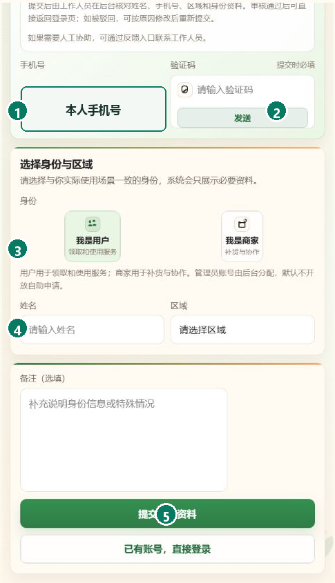
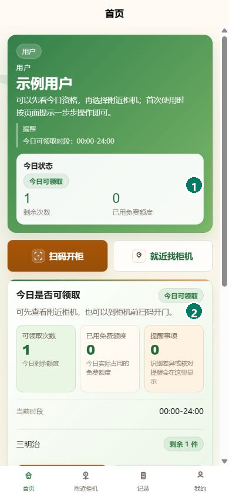
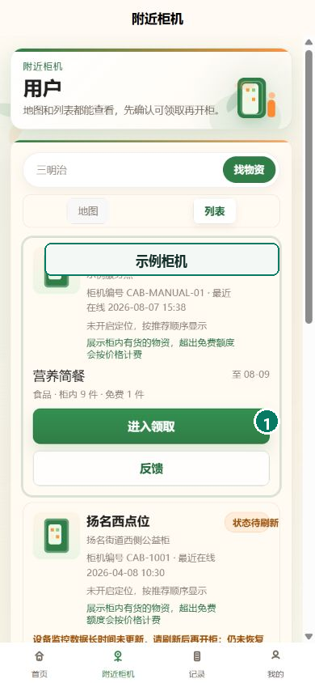
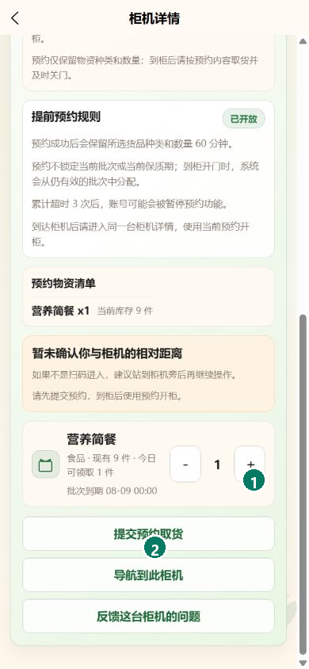
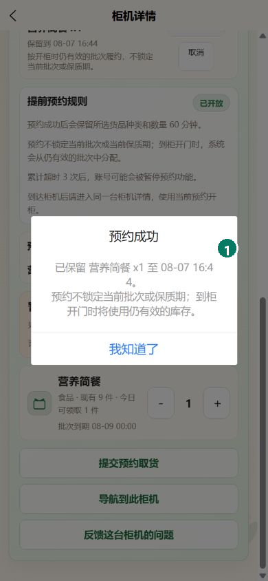
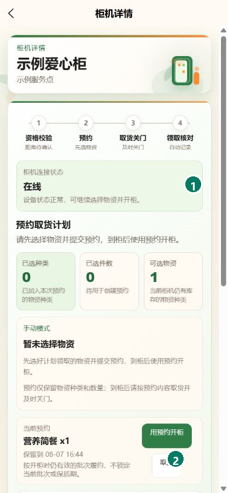
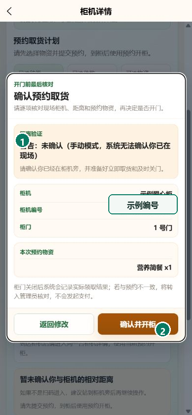
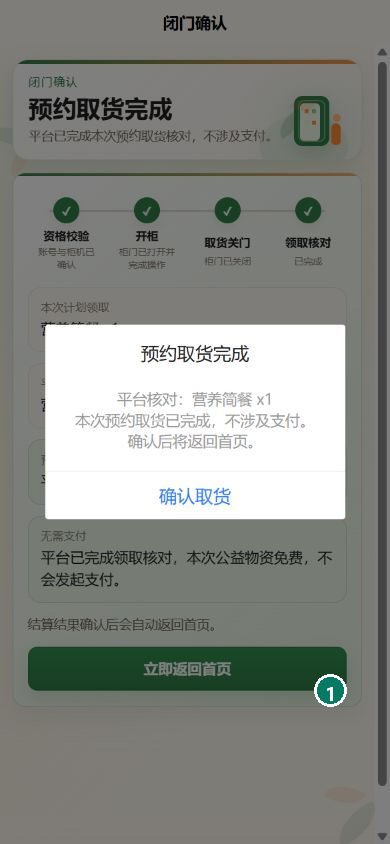

# 公益智助柜｜App 用户使用手册

按照下面的步骤，你可以完成首次登记、登录、预约和到柜领取。公益领取不会要求付款。

## 1. 首次登记资料

**用途：** 手机号尚未登记时，提交姓名、身份和所在区域，等待工作人员审核。

1. 在登录页选择“首次使用 / 去登记”。
2. 输入本人手机号，获取并填写短信验证码。
3. 选择“我是用户”和实际所在区域。
4. 填写姓名；需要说明的情况可写在备注中。
5. 选择“提交注册资料”。

**完成标志：** 页面提示申请已提交；审核通过后可返回登录页使用本人手机号登录。

## 2. 使用短信验证码登录

**用途：** 使用本人手机号完成日常登录和身份识别。

1. 打开公益智助柜移动端。
2. 输入本人手机号，并勾选用户免责声明。
3. 选择“获取验证码”，填写收到的短信验证码。
4. 选择“登录 / 身份识别”。

**完成标志：** 页面进入首页并显示本人姓名和今日资格。登录状态有效时，下次打开可直接进入首页。

## 3. 使用一次性人工码备用登录

**用途：** 短信暂时无法接收时，使用工作人员单独交付的一次性验证码登录。

1. 在登录页输入本人手机号。
2. 填写收到的 6 位一次性人工码。
3. 勾选用户免责声明。
4. 选择“登录 / 身份识别”。

**完成标志：** 成功进入首页；人工码随即失效，不能再次使用。

## 4. 查看今天是否可以领取

**用途：** 在选择柜机前确认今日时段、剩余次数和可领取物资。

1. 在首页查看“今日状态”。
2. 核对当前时段和剩余次数。
3. 查看页面列出的今日可领取物资。
4. 有资格时选择“就近找柜机”。

**完成标志：** 页面显示“今日可领取”，剩余次数大于 0。

## 5. 找到可用柜机

**用途：** 从附近柜机中选择在线且有库存的服务点。

1. 打开“附近柜机”。
2. 可按物资名称筛选。
3. 查看柜机位置、在线状态和现有物资。
4. 选择目标柜机进入详情。

**完成标志：** 目标柜机显示“在线”，并列出计划领取的物资。

## 6. 选择物资

**用途：** 按今日额度选定预约物资和数量。

1. 在柜机详情查看提前预约规则。
2. 在物资卡片中选择数量。
3. 核对已选种类、件数和当前库存。
4. 确认没有超过今日可领取数量。

**完成标志：** “已选种类”和“已选件数”显示本次计划领取的数量。

## 7. 提交预约

**用途：** 为所选物资建立有时限的预约。

1. 选择“提交预约取货”。
2. 等待页面显示“预约成功”。
3. 核对物资、数量和保留截止时间。
4. 选择“我知道了”返回柜机详情。

**完成标志：** 柜机详情出现“当前预约”，并显示预约物资和保留时间。

## 8. 打开当前预约

**用途：** 在预约有效期内回到同一台柜机，开始现场领取。

1. 到达预约对应的柜机。
2. 在柜机详情刷新状态。
3. 确认柜机显示“在线”。
4. 在“当前预约”选择“用预约开柜”。

**完成标志：** 页面进入开柜前核对，不再提示柜机离线或预约过期。

## 9. 开柜前最后核对

**用途：** 在开门前再次确认现场柜机、柜门和预约物资。

1. 核对自己已经站在正确柜机旁。
2. 核对柜机名称、柜门和预约物资。
3. 确认可以立即取货并及时关门。
4. 选择“确认并开柜”。

**完成标志：** 页面显示开门请求已提交；此时不重复点击开柜。

## 10. 关门并查看领取结果

**用途：** 完成现场取货，确认系统记录与实际领取一致。

1. 取出预约物资后立即关好柜门。
2. 等待页面完成“取货关门”和“领取核对”。
3. 核对计划领取与平台实际结果。
4. 选择“确认取货”返回首页。
5. 在“记录”中查看本次领取。

**完成标志：** 页面显示“预约取货完成”，记录中出现同一柜机、物资和时间。

## 遇到问题

- **登记后仍不能登录：** 申请可能仍在审核中；资料被驳回时按页面原因修改后重新提交。
- **收不到短信验证码：** 核对手机号和网络，等待倒计时结束后再获取一次；急需登录时可联系工作人员取得一次性人工码。
- **提示没有资格：** 核对今日时段、剩余次数和资料状态。
- **预约过期：** 过期预约不能继续开柜，可重新选择仍有库存的物资预约。
- **开门后结果一直待确认：** 不重复开门，保持柜门关闭并联系工作人员核对处理结果。
