# 公益智助柜｜商户使用手册

用于维护常用商品、核对已分配柜机，并在移动端完成补货和记录查询。

## 1. 登录电脑后台

**用途：** 进入商家工作台，确认账号对应的实例和商家资料。

1. 打开 `https://vending.5gogogo.top/login`。
2. 填写已开通的后台账号和密码。
3. 选择“进入后台”。
4. 核对左侧身份为“商家”。

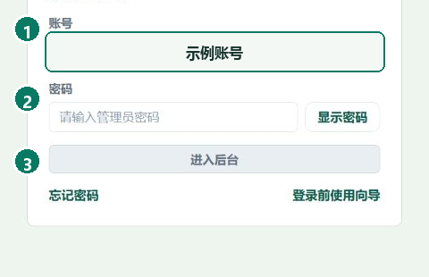

**完成标志：** 登录后自动进入“商家工作台”，页面显示本人可补货范围。

## 2. 查看商家工作台

**用途：** 在出发前确认可用模板、累计补货、被领取件数和最近入柜记录。

1. 打开“商家工作台”。
2. 核对“可用模板”“累计补货”和“被领取件数”。
3. 查看“最近入柜记录”，确认上次操作时间和数量。
4. 检查“可补货清单”，确定本次需要处理的商品。

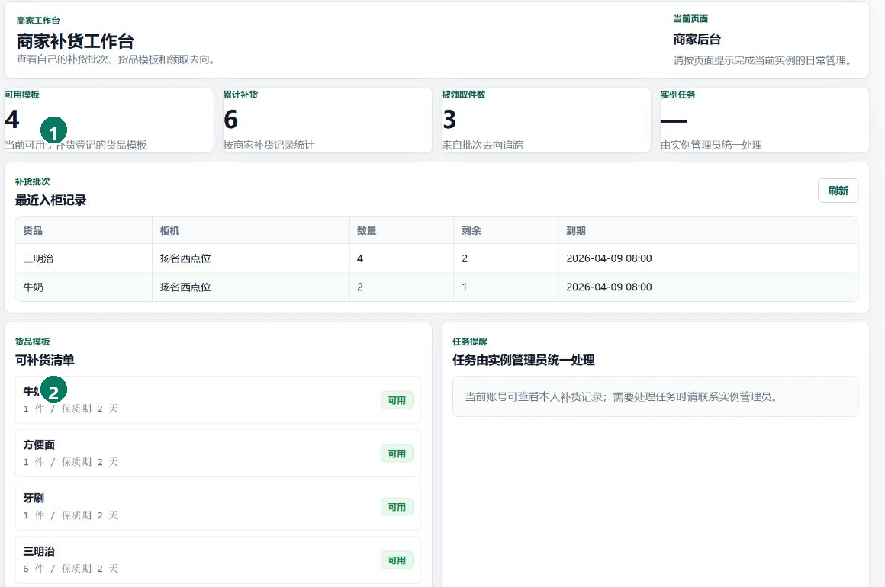

**完成标志：** 本次可用模板和补货清单已明确，最近入柜记录可以核对。

## 3. 维护常用商品

**用途：** 建立补货时可直接选择的商品模板，减少现场重复录入。

1. 在移动端商家首页选择“常用商品”。
2. 填写商品编号、全称、简称、分类、规格和厂家。
3. 设置默认数量和默认保质天数。
4. 需要图片时选择拍摄或本地图片。
5. 选择“新增常用商品”，再在列表中检索核对。

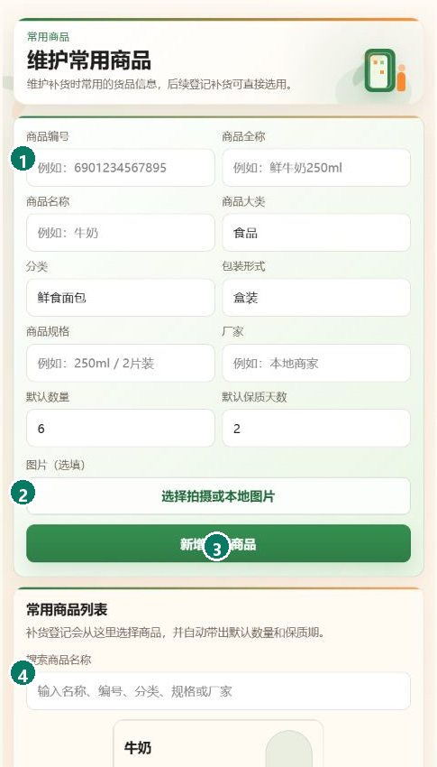

**完成标志：** 新商品出现在常用商品列表，补货登记时可直接选择。

## 4. 核对已分配柜机

**用途：** 确认本次工作使用的柜机属于当前账号范围。

1. 打开“柜机监控”。
2. 按名称或位置找到目标柜机。
3. 核对在线状态、最近平台确认和门状态。
4. 选择“详情”查看库存和待处理任务。

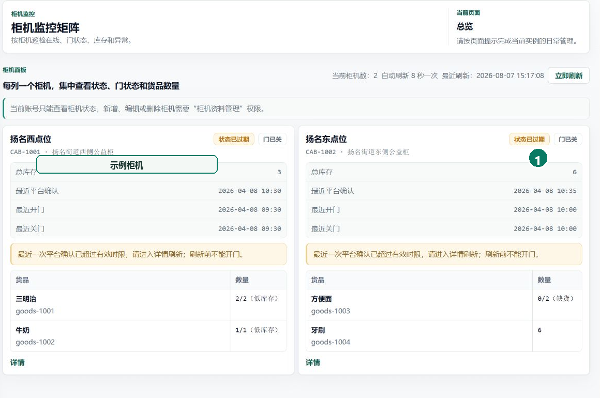

**完成标志：** 目标柜机出现在列表中，状态和位置与现场一致。

## 5. 登录移动端

**用途：** 在现场进入本人商家工作台，并保持后续登录状态。

1. 打开公益智助柜移动端，输入本人手机号。
2. 正常情况下选择“获取验证码”，填写短信验证码。
3. 短信暂时无法接收时，填写管理员单独交付的一次性人工码。
4. 勾选免责声明，选择“登录 / 身份识别”。
5. 登录后核对首页身份为“商家”。

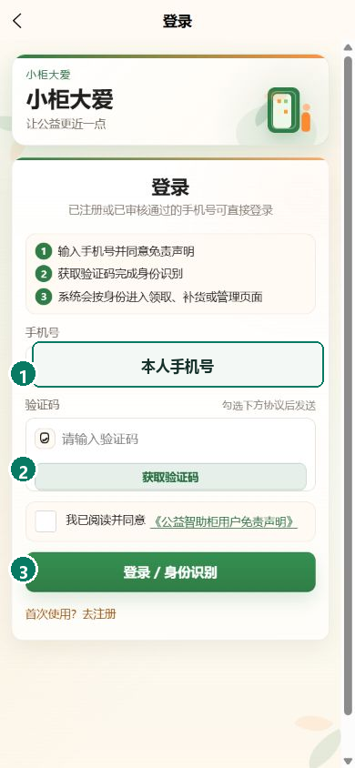

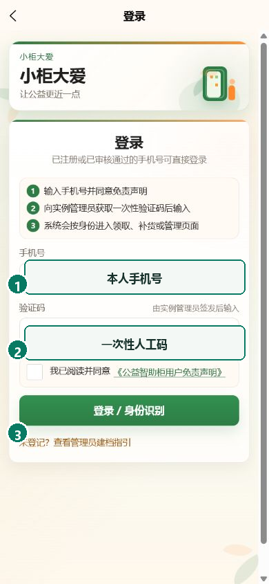

**完成标志：** 页面进入商家首页；登录状态有效时，下次打开可直接进入工作台。

## 6. 进入移动补货工作台

**用途：** 从本人已分配的柜机中选择本次现场作业对象。

1. 在首页核对身份和待处理提示。
2. 选择“补货”或“选择柜机补货”。
3. 在柜机列表核对名称、位置和状态。
4. 选择目标柜机。

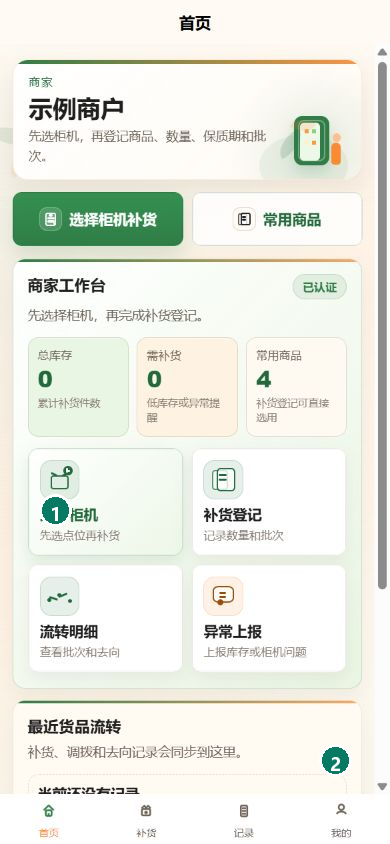

**完成标志：** 补货页只显示当前账号已分配的柜机。

## 7. 开柜前核对

**用途：** 在开门前确认柜机、门状态和本次入柜商品。

1. 选择目标柜机的“补货 / 开门”。
2. 核对柜机名称和在线状态。
3. 选择本次准备入柜的商品。
4. 到达柜机旁后确认开门。

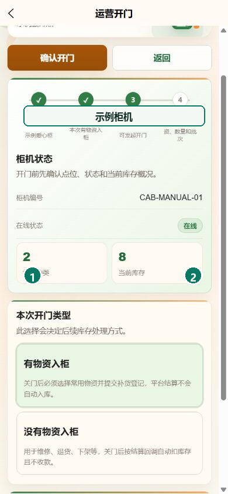

**完成标志：** 页面确认开门请求成功，并进入关门后的入柜登记步骤。

## 8. 登记入柜数量

**用途：** 记录柜门关闭后实际放入的商品、数量和批次信息。

1. 完成现场入柜并关好柜门。
2. 在“入柜商品登记”填写商品和数量。
3. 核对生产日期；有批次号时一并填写。
4. 在提交确认区复核商品、数量和预计到期日。
5. 选择“提交入柜记录”。

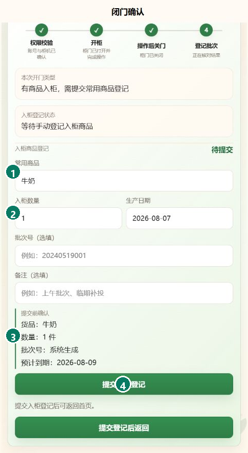

**完成标志：** 页面返回商家首页，总库存和最近货品流转均显示本次入柜。

## 9. 核对结果和历史记录

**用途：** 确认补货已经落账，并保留可追查的批次与流转记录。

1. 返回首页核对总库存和最近货品流转。
2. 打开“记录”。
3. 按日期核对商品、批次、剩余数量和到期时间。
4. 数量不一致时保留当前记录，不重复提交。

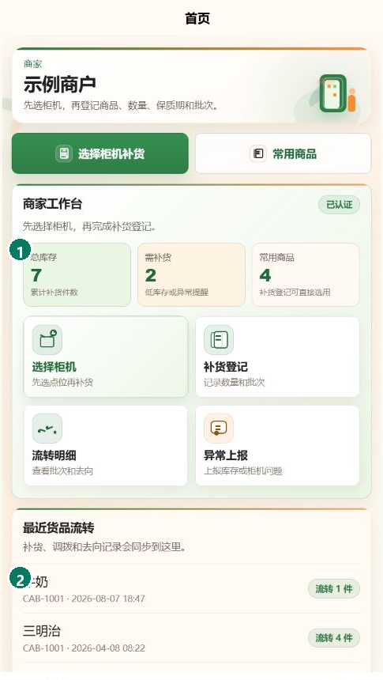

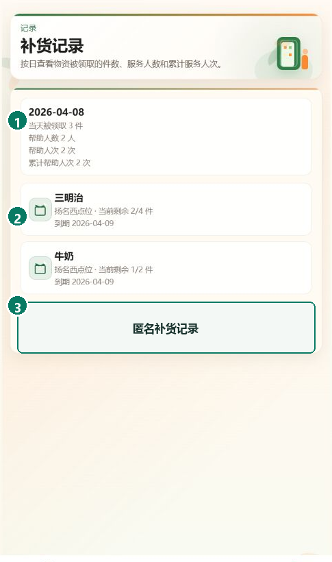

**完成标志：** 首页和记录页均出现本次商品、数量、柜机与时间。

## 遇到问题

- **目标柜机不在列表：** 由实例管理员检查账号状态和柜机分配。
- **柜机显示离线或状态过期：** 先刷新；仍未恢复时暂停开门并记录现场情况。
- **没有可补货商品：** 核对常用商品列表；仍为空时由实例管理员检查商品状态。
- **关门后没有登记页：** 保留当前页面，确认柜门已关并等待状态更新，避免重复开门。
- **结果数量不一致：** 保存记录页和现场数量，由实例管理员从日志核对。
