# 公益智助柜｜实例管理员使用手册

用于管理当前实例的注册申请、人员账号、领取规则、货品库存、柜机状态和操作记录。

## 1. 登录并核对当前实例

**用途：** 确认账号已进入正确实例，避免把资料保存到其他实例。

1. 打开 `https://vending.5gogogo.top/login`。
2. 在“账号”和“密码”中填写已开通的后台凭据。
3. 选择“进入后台”。
4. 登录后核对页面顶部的实例名称和左侧显示的身份。

**完成标志：** 页面顶部显示目标实例，左侧身份为“实例管理员”。

## 2. 设置领取方式与预约规则

**用途：** 确定用户按预约取货还是即时领取，并设置预约保留规则。

1. 打开“系统设置”。
2. 在“领取方式”中选择“预约后取货”或“即时领取”。
3. 在“领取差异额度”中选择当前业务采用的归属方式。
4. 保存设置，再刷新页面核对结果。
5. 使用预约取货时，在“人员管理”核对预约开关、保留分钟数和连续超时限制。

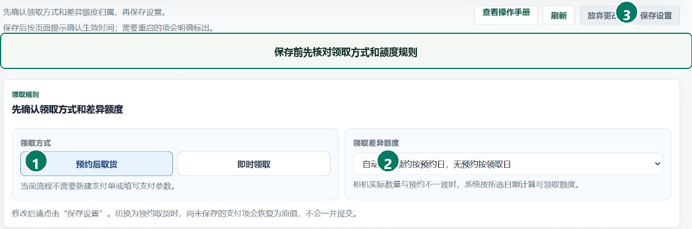

**完成标志：** 页面显示“已同步”，刷新后仍保持选定的领取方式和规则。

## 3. 审核注册申请

**用途：** 核对首次注册人员的身份资料，并决定是否准予进入当前实例。

1. 打开“人员管理”，定位“注册审核”。
2. 在“待审核”中核对姓名、手机号、身份和区域。
3. 资料符合当前实例要求时选择“通过”。
4. 资料不完整或不符合要求时填写原因，再选择“驳回”。
5. 在“已登记”或“已驳回”中复核处理结果。

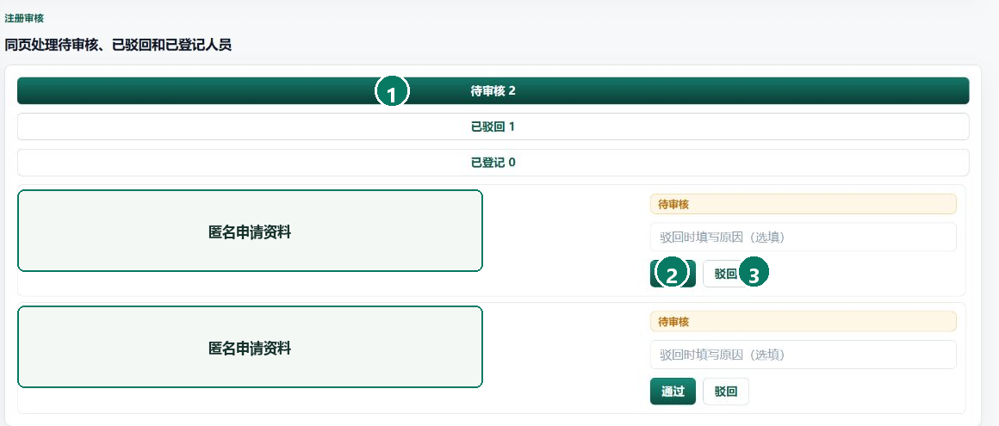

**完成标志：** 申请不再停留在“待审核”；通过的申请已进入当前实例人员台账。

## 4. 新建人员资料

**用途：** 为实例管理员、商家、补货员或特殊群体建立人员资料。

1. 打开“人员管理”，选择“新增人员”。
2. 选择后台显示的岗位，并填写姓名、手机号、状态和区域。
3. 特殊群体如需每日物资规则，选择“保存并配置每日物资”。
4. 其他岗位选择“保存人员信息”。
5. 返回人员台账，按姓名核对新记录。

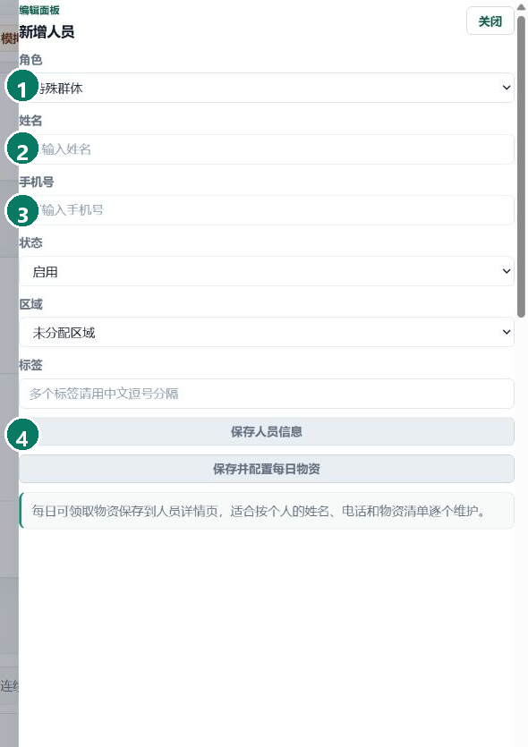

**完成标志：** 人员出现在当前实例台账中，岗位、状态和手机号均与录入内容一致。

## 5. 使用 Excel 批量导入人员

**用途：** 批量建立特殊群体或商家资料，并在写入前处理格式错误。

1. 在“人员管理”选择“下载 Excel 模板”。
2. 在模板的人员工作表填写资料，保留首行列名。
3. 返回页面选择“导入 Excel”，并指定导入岗位。
4. 上传 `.xlsx` 文件，先查看错误行和前十行预览。
5. 修正全部错误后再确认导入。
6. 导入商家后，逐个配置后台账号和柜机范围。

**完成标志：** 错误预览为空，页面报告导入成功；抽查人员台账与表格内容一致。

## 6. 创建岗位与后台账号

**用途：** 为使用电脑后台的人员开通与岗位一致的菜单和操作权限。

1. 在人员台账找到目标人员，打开“配置权限”。
2. 核对后台身份为实例管理员、商家或补货员。
3. 填写登录账号；首次开通时设置临时密码。
4. 仅勾选该岗位实际需要的权限。
5. 保存后使用该账号重新登录，核对可见菜单。

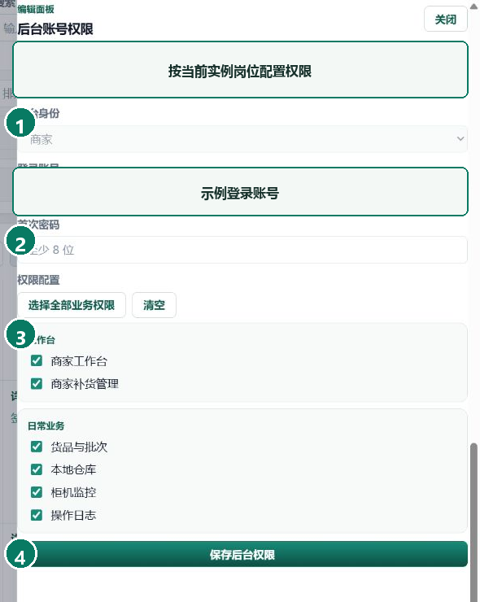

**完成标志：** 目标账号可登录，页面只显示已配置的工作台和业务菜单。

## 7. 分配可管理柜机

**用途：** 限定商家或补货员可以查看和操作的柜机范围。

1. 在人员台账找到目标商家或补货员。
2. 选择“分配柜机”。
3. 勾选其负责的柜机。
4. 保存柜机范围。
5. 使用目标账号打开柜机列表，核对只出现已分配柜机。

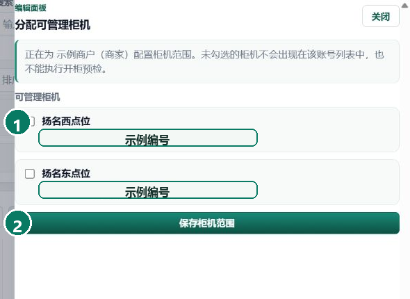

**完成标志：** 人员台账显示正确的柜机数量，目标账号无法看到未分配柜机。

## 8. 管理一次性人工验证码

**用途：** 在短信暂时不可用等特殊情况下，为已启用账号提供一次性备用登录码。

1. 在人员台账选择目标人员的“签发验证码”。
2. 选择“APP / 小程序登录”或“后台密码重置”。
3. 默认选择 10 分钟有效期；只有经明确批准的特殊场景才调整为更长时间。
4. 选择“签发一次性验证码”，并通过约定渠道交付本人。
5. 尚未使用的记录可选择“撤销”。
6. 已使用、已过期或已撤销的记录可选择“清除记录”。

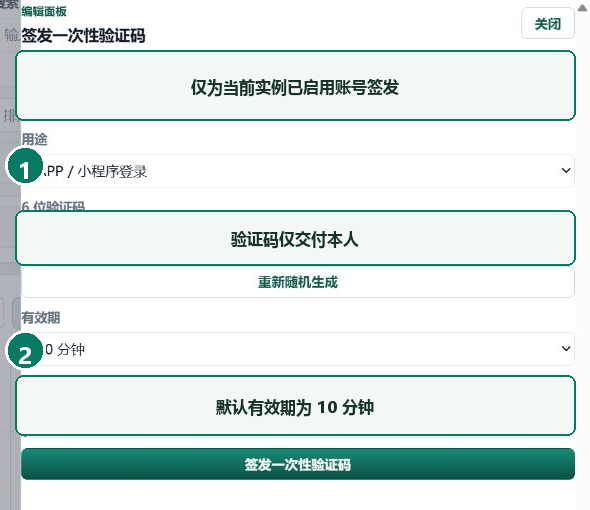

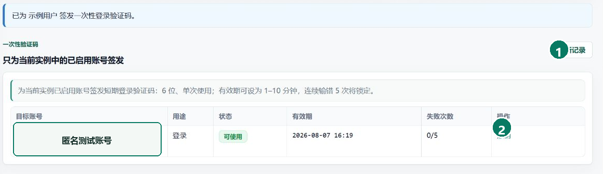

**完成标志：** 新记录显示用途、状态和有效期；撤销后不能登录，清除后不再出现在记录列表。

## 9. 维护货品与本地仓库

**用途：** 维护可领取物资资料，并核对进入柜机前的库存批次。

1. 在“货品总览”新增或编辑货品名称、分类和状态。
2. 保存后按货品名称检索一次。
3. 打开“本地仓库”，核对批次、数量和到期时间。
4. 发生入库、调拨或报损后，重新打开批次确认数量变化。

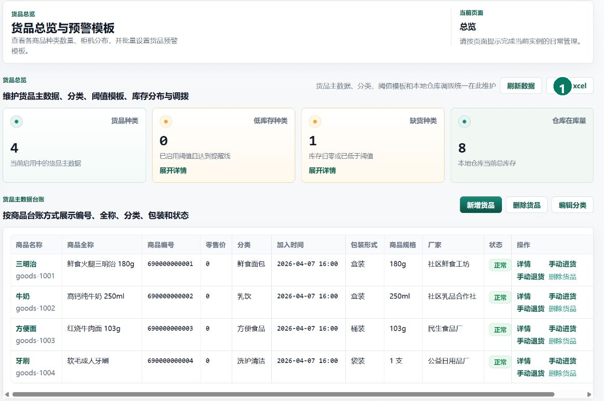

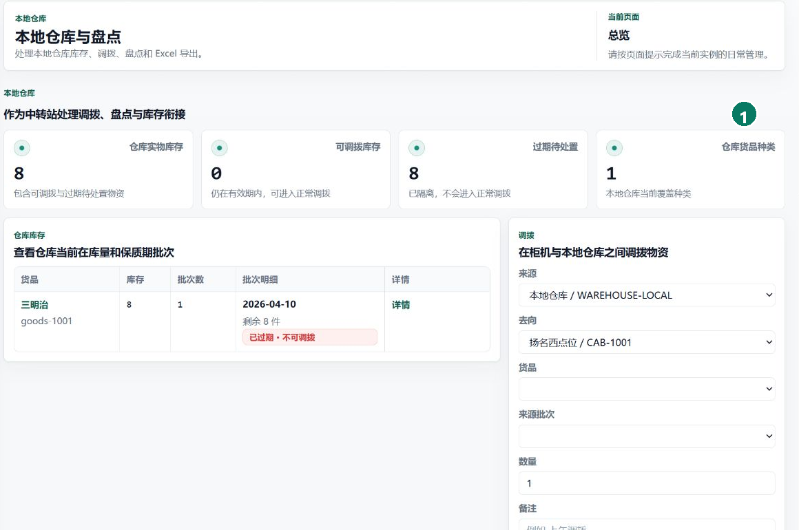

**完成标志：** 货品资料可检索，仓库数量与最新业务单据一致。

## 10. 查看柜机状态

**用途：** 在安排补货或领取前核对柜机状态和最近平台确认时间。

1. 打开“柜机监控”。
2. 查看目标柜机的在线状态、最近平台确认和门状态。
3. 进入详情核对库存和待处理任务。
4. 状态过期或显示离线时先执行刷新。
5. 平台返回新状态后，再判断是否可以继续现场操作。

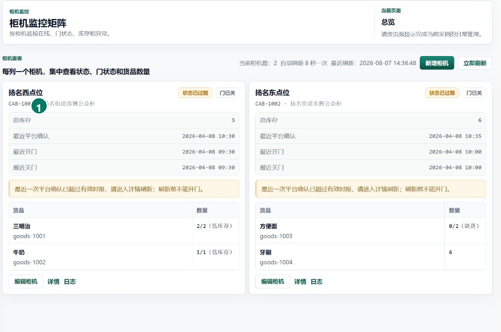

**完成标志：** 已识别柜机当前状态；最近确认时间有效时，门状态和库存信息均可核对。

## 11. 查日志与处理密码

**用途：** 追查人员、货品、柜机和账号变更，并恢复后台访问。

1. 打开“日志总览”，按时间或对象查找操作。
2. 进入详情核对动作人、对象、结果和时间。
3. 已登录且知道当前密码时，从侧栏选择“修改密码”。
4. 无法登录时，从登录页选择“忘记密码”，使用绑定手机号和密码重置验证码完成重置。
5. 重置后使用新密码登录一次。

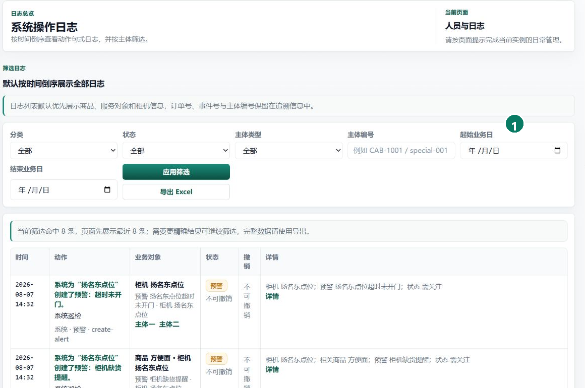

**完成标志：** 日志能够定位到目标操作；新密码可登录，旧会话已经失效。

## 遇到问题

- **页面提示无权限：** 核对当前身份和实例；由同一实例的其他管理员检查后台权限。
- **Excel 无法确认导入：** 按错误预览逐行修正，保留模板列名，文件使用 `.xlsx` 格式。
- **验证码无法使用：** 核对用途、状态和有效期；已使用、撤销、锁定或过期的记录需重新签发。
- **柜机离线或门状态未知：** 刷新后仍未恢复时暂停远程操作，记录柜机和时间并安排现场检查。
- **密码重置失败：** 核对登录账号与绑定手机号；验证码失效时重新获取，避免连续重复提交。
