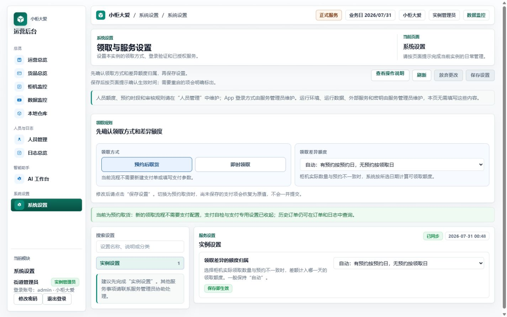

# 实例管理员使用手册

实例管理员使用电脑后台管理当前实例的人员、货品、库存、柜机、预约规则和操作记录。

## 登录后台

1. 打开 [电脑后台](https://vending.5gogogo.top/login)。
2. 输入已经开通的后台账号和密码。
3. 登录后确认左侧身份为“实例管理员”，并核对当前实例名称。
4. 从左侧“操作手册”可随时返回本说明。

## 设置预约领取

打开“系统设置 → 领取与服务设置”：

1. 开启“预约取货”。
2. 按业务规定选择额度差额归属；没有特殊规定时使用“自动”。
3. 选择当前 App 登录方式。
4. 保存后重新进入页面，确认设置仍与刚才一致。

预约取货不会创建支付步骤。App 出现付款要求时，请暂停操作并检查本页设置。

## 建档和分配权限

1. 打开“人员管理”，新建人员或处理待审核申请。
2. 核对姓名、手机号和申请身份。
3. 选择实例管理员、商户、补货员或普通用户。
4. 需要使用电脑后台的人员应开通后台账号。
5. 给商户和补货员分配可查看的柜机。
6. 启用人员后，重新打开详情核对角色、账号状态和柜机范围。

普通用户只使用 App，不需要电脑后台账号。建议至少保留两名可登录的实例管理员。

## 使用 Excel 批量导入人员

批量导入只用于特殊群体 / App 用户和商家。实例管理员与补货员需要逐个核对后台权限、密码策略和柜机范围，不能从 Excel 批量创建。

1. 打开“人员管理”，点击“下载 Excel 模板”。
2. 在模板第一张“人员导入”工作表填写资料，不要修改第一行列名。
3. 姓名和手机号必填；区域、区域编号和标签可选。多个标签可用逗号或分号分隔。
4. 导入特殊群体时可填写每日总额度和分类额度。只要填写分类额度，就必须同时填写每日总额度。
5. 回到“人员管理”，点击“导入 Excel”，选择“特殊群体 / App 用户”或“商家”。
6. 上传 .xlsx 文件，按行修正页面列出的错误，再核对前 10 行预览。
7. 确认导入。当前实例内同手机号、同角色的人员会更新并重新启用；跨实例或跨角色冲突会使整批失败。
8. 导入商家后，逐个分配柜机并开通后台账号。导入特殊群体后，按业务需要配置每日物资规则。

每个文件不超过 2 MB，每次最多 500 人。不要把正式手机号、验证码或密码填入“填写示例（勿直接导入）”工作表。

## 管理货品、库存和柜机

1. 在“货品总览”维护货品资料和图片。
2. 在“本地仓库”核对批次、可用库存和到期时间。
3. 在“柜机监控”查看柜机在线状态、货门和柜内库存。
4. 完成新增、编辑或调拨后，重新打开详情确认结果。
5. 在“日志总览”核对关键操作的时间、对象和结果。

未接入真实柜机时，柜机或可预约库存可能为空。此时不要引导用户到现场领取。

## 签发 App 一次性验证码

1. 在“人员管理”找到已经建档并启用的 App 用户。
2. 打开“人工验证码”，用途选择“APP / 小程序登录”。
3. 输入本次使用的 6 位验证码并设置有效期。
4. 通过私下渠道交给本人。
5. 用户登录后检查验证码状态。已使用、过期、撤销或输错达到上限的验证码不能继续使用。

一次性验证码不能代替建档，也不能多人共用。

## 修改或找回后台密码

知道当前密码时，在左侧选择“修改密码”，输入当前密码和两次新密码。

忘记密码时：

1. 从登录页进入“忘记密码”。
2. 输入后台账号和资料中绑定的手机号。
3. 请另一名实例管理员签发“后台密码重置”用途的验证码。
4. 输入验证码和两次新密码后提交。
5. 重置成功后重新登录；旧会话会失效。

如果当前实例只有一名管理员且无法取得找回验证码，请联系技术支持。
