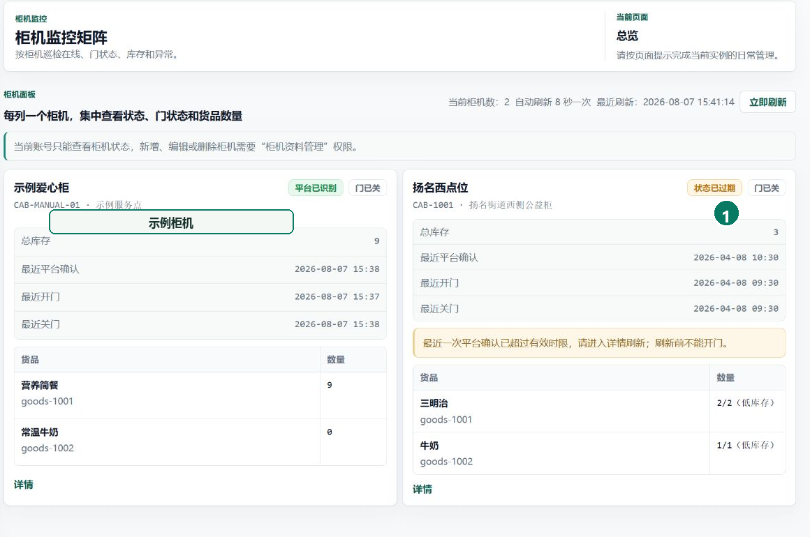
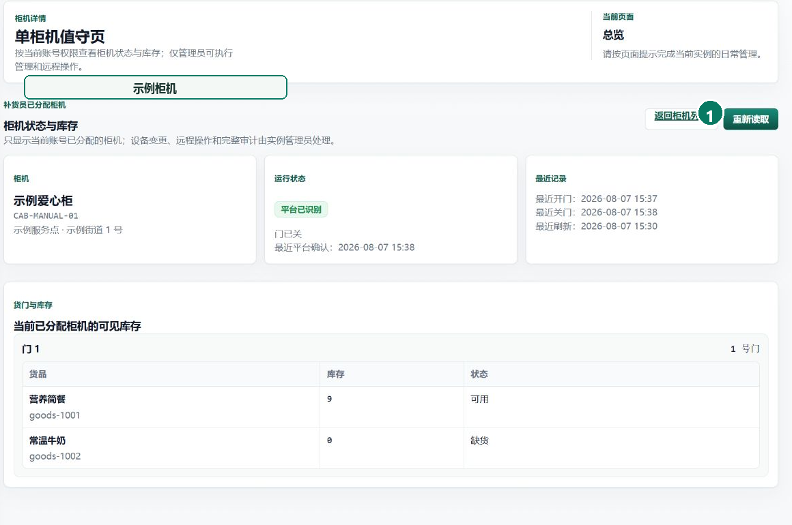
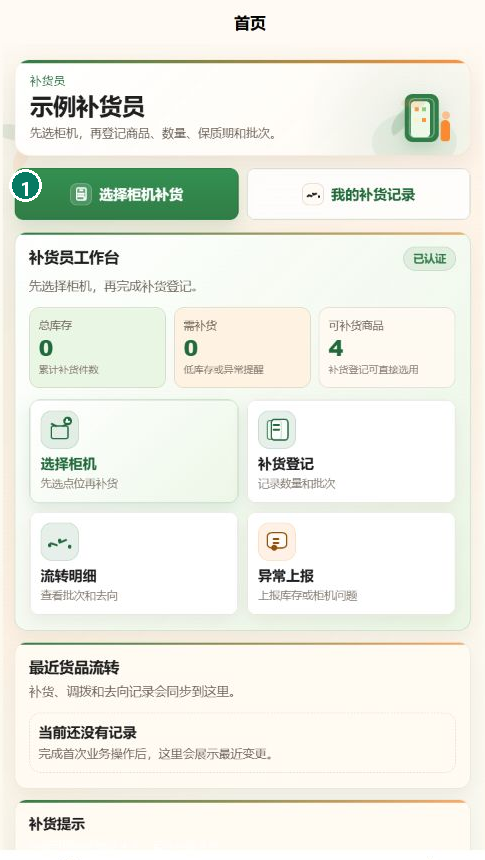
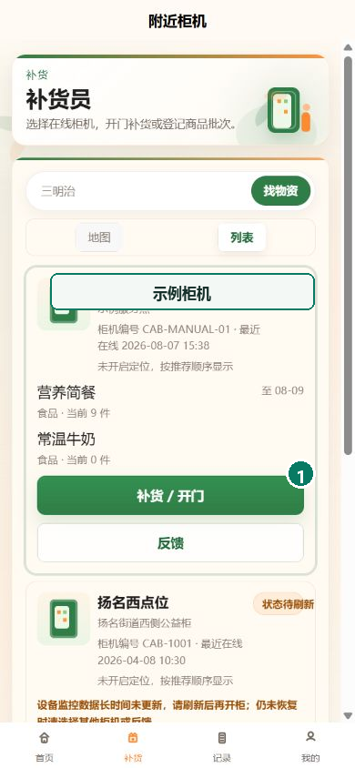
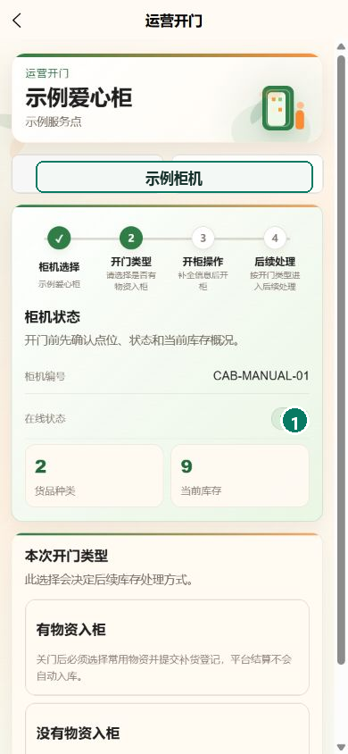
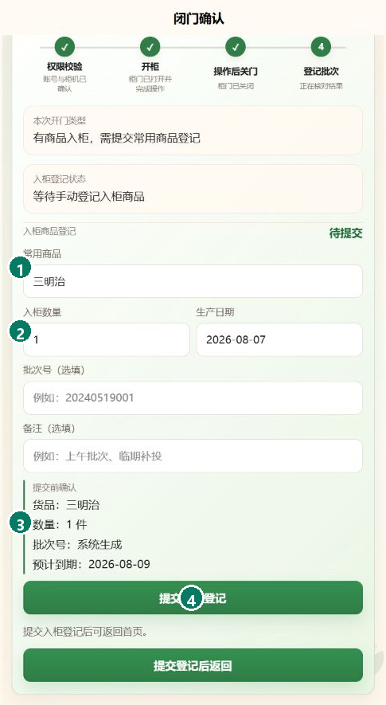
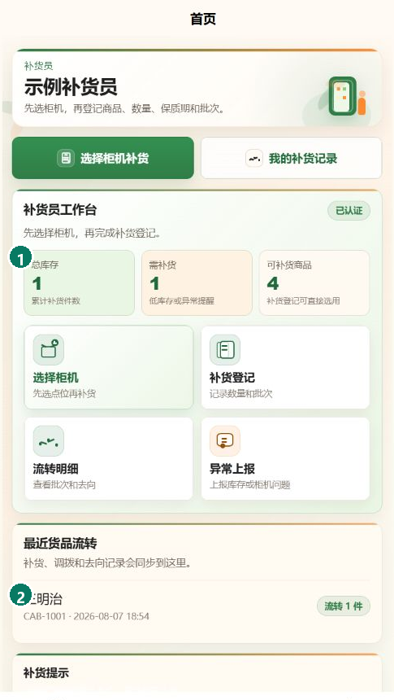

# 公益智助柜｜补货员使用手册

用于查看本人负责的柜机，在现场完成状态核对、开门、入柜登记和异常反馈。

## 1. 登录电脑后台

**用途：** 进入本人工作范围，避免操作未分配柜机。

1. 打开 `https://vending.5gogogo.top/login`。
2. 填写已开通的后台账号和密码。
3. 选择“进入后台”。
4. 核对左侧身份为“补货员”。

**完成标志：** 后台仅显示补货所需菜单，柜机列表只包含本人负责的柜机。

## 2. 查看已分配柜机

**用途：** 在出发前确认目标柜机、位置和最近状态。

1. 打开“柜机监控”。
2. 按名称或位置找到目标柜机。
3. 核对最近平台确认和门状态。
4. 状态过期或显示离线时先刷新，再决定是否前往现场。

**完成标志：** 已识别目标柜机当前状态；最近确认时间有效时，门状态清晰可查。

## 3. 查看柜机详情

**用途：** 核对柜内库存、货门和待处理任务，确定本次补货内容。

1. 从柜机列表选择“详情”。
2. 核对柜机位置和门状态。
3. 查看各商品现有数量。
4. 记录低库存、长时间敞门或用户反馈任务。

**完成标志：** 本次计划入柜的商品和数量已经明确，异常项已记录。

## 4. 登录移动端

**用途：** 在现场进入本人补货工作台，并保持后续登录状态。

1. 打开公益智助柜移动端，输入本人手机号。
2. 正常情况下选择“获取验证码”，填写短信验证码。
3. 短信暂时无法接收时，填写管理员单独交付的一次性人工码。
4. 勾选免责声明，选择“登录 / 身份识别”。
5. 登录后核对首页身份为“补货员”。

**完成标志：** 页面进入补货员首页；登录状态有效时，下次打开可直接进入工作台。

## 5. 进入移动补货页

**用途：** 从本人已分配的柜机中选择现场作业对象。

1. 在首页核对身份和补货提示。
2. 选择“补货”或“选择柜机补货”。
3. 在列表中核对柜机名称、位置和状态。
4. 选择目标柜机的“补货 / 开门”。

**完成标志：** 页面进入目标柜机操作页，显示的柜机与现场一致。

## 6. 开门并完成现场操作

**用途：** 在柜机状态明确时发起补货开门，并在操作后关好柜门。

1. 核对柜机在线状态和门状态。
2. 选择本次准备入柜的商品。
3. 确认人员已经在柜机旁。
4. 选择开门并等待页面返回结果。
5. 完成入柜后立即关好柜门。

**完成标志：** 页面收到开门结果，现场柜门已经关闭。

## 7. 填写入柜记录

**用途：** 记录实际入柜商品、数量和批次，供库存与日志核对。

1. 在关门确认页填写商品名称和入柜数量。
2. 核对生产日期；有批次号时一并填写。
3. 如有现场异常，在备注中写明现象。
4. 在提交确认区复核商品、数量和预计到期日。
5. 选择“提交入柜记录”。

**完成标志：** 页面返回补货员首页，总库存和最近货品流转均显示本次入柜。

## 8. 核对结果并反馈异常

**用途：** 确认补货已经记录，并提交需要后续处理的现场异常。

1. 返回首页核对总库存和最近货品流转。
2. 打开“我的补货记录”查看最新记录。
3. 库存、门状态或结果不一致时保存页面信息。
4. 返回首页选择“异常上报”，填写柜机、时间和现场现象。

**完成标志：** 最新补货记录可查；异常反馈包含柜机、时间和现场现象。

## 遇到问题

- **目标柜机不在列表：** 由实例管理员核对柜机分配，不使用其他账号代替操作。
- **柜机离线或状态过期：** 暂停开门，刷新一次并记录现场网络与指示灯状态。
- **开门后未收到结果：** 不重复发起开门，等待页面更新并联系实例管理员核对日志。
- **柜门无法确认关闭：** 现场检查门体是否到位，页面仍未知时停止后续登记。
- **提交数量错误：** 保留结果页，不重复提交；由实例管理员按日志处理差异。
