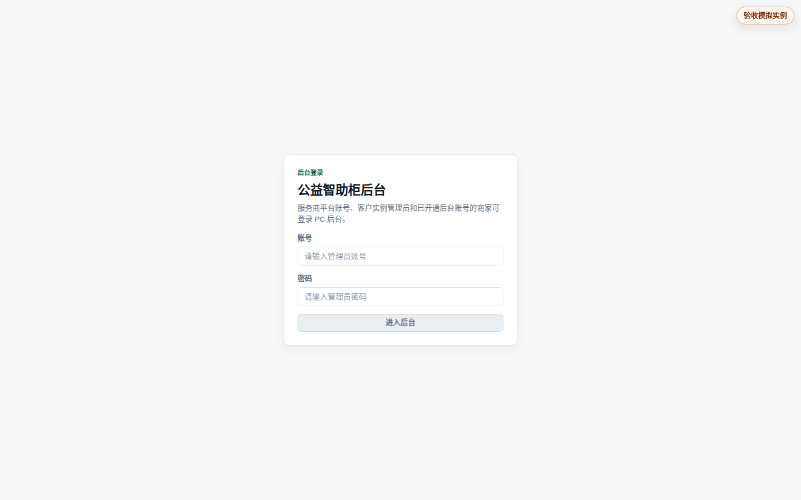
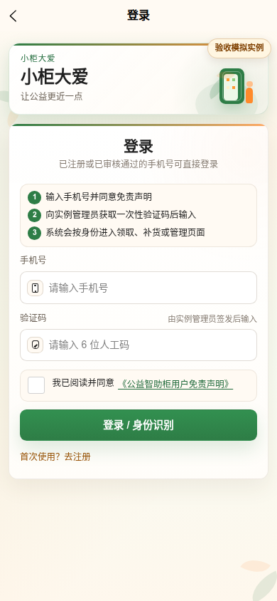

# 系统设置与 App 验收使用说明

本说明面向当前模拟实例的实例管理员。它把日常可操作的示例设置、后台签发人工验证码和 App 登录验收分开说明；外部服务密钥、服务器路径和真实支付资料不写入本说明。

## 1. 先使用“示例设置”

后台“系统设置”页的首个入口是“示例设置”。日常验收只需要确认下列三项：

| 项目 | 推荐值 | 作用 |
| --- | --- | --- |
| 预约取货 | 开启 | 用户必须先预约再取货；新的领取流程不创建支付单，也不需要填写支付配置。 |
| 领取差异的额度归属 | 自动 | 柜机实际领取数量与预约不一致时，有预约按预约日计入额度，无预约按实际领取日计入额度。 |
| App 登录验证方式 | 手动设置验证码 | 实例管理员为已启用人员单独签发 6 位、短期、一次性的登录码，不发送短信。 |

关闭“预约取货”仅用于非预约领取流程的隔离测试。关闭后，页面才会显示支付验证和支付自检；这不修改历史订单，也不等同于启用真实支付。

保存设置后，以页面提示为准重启 API 服务；未重启时，标有“重启后生效”的设置不会用于新流程。

## 2. 运行环境为什么是下拉框

`Node 运行环境` 和 `应用运行环境` 只能选择 `development`、`test` 或 `production`，不再允许任意输入。两项通常保持一致：

- `development`：本地开发或普通模拟。
- `test`：自动化测试。
- `production`：由受控部署流程固定的公网运行环境，服务运行期间不能在后台修改。

数据平面仍只有“模拟”和“实机”两类。数据、审计、上传、备份路径以及当前实例名称均由发布流程固定，只能查看，不能在后台在线修改。`mock`、阿里云 PNVS 和人工验证码是登录验证实现方式，不会新增第三种运营环境。

## 3. 人工验证码登录 App

人工验证码只用于当前实例内、已启用人员的 App / 小程序登录或本人密码重置，不用于电脑后台 `admin` 账号登录。

如果唯一 `admin` 后台账号无法登录，不要反复猜测密码，也不要把 App 人工验证码用于后台登录；只能由已获授权的操作员通过 Spark VNC 本机终端走受控恢复流程。该流程和人工验证码相互独立，会撤销旧后台会话，详细门禁见[发布与公网部署验证流程](发布与公网部署验证流程.md)。

1. 使用实例管理员账号进入后台，打开“人员管理”。
2. 确认测试人员已存在、已启用且属于当前实例；没有人员时先新建“特殊群体”人员并保存。
3. 在该人员的操作中点击“签发人工码”。
4. 用途选择“APP / 小程序登录”，在“6 位验证码”中输入本次验收码，设置 60–600 秒的有效期，然后签发。
5. 打开 App 登录页，填写该人员手机号、验证码，勾选免责声明后登录。
6. 登录成功后确认进入对应角色首页；回到后台的人工验证码记录，状态应为“已使用”。
7. 用同一验证码再次登录，必须被拒绝；这验证了单次消费保护。

本次验收码只在受控签发页面输入，不写入环境变量、命令、日志或本说明。验证码过期、撤销、输错达到上限或首次成功使用后，都必须重新签发。

## 4. 已验证界面

以下两张截图来自 2026-07-28 的公网 HTTPS 部署，版本为 `14a02cb`。截图只展示公开页面与引导文案，不含账号、密码、手机号或人工验证码。

后台从登录页进入，实例管理员在本机安全输入凭据后才进入当前实例后台：

移动端以 390×844 手机视口验证。当前为“手动设置验证码”模式，因此页面明确提示向实例管理员获取一次性验证码、验证码输入框限制为 6 位，且不显示“获取验证码”按钮：

## 5. 截图验收清单

本次已完成后台登录页与 App 手动验证码登录页截图。认证后的截图只能在当前实例管理员的安全登录会话中补齐，必须遮住手机号和验证码，并按下表逐项标注结果：

| 截图 | 应看到的结果 |
| --- | --- |
| 后台登录与实例工作台 | 实例管理员进入当前实例，而不是服务提供商跨实例页面。 |
| 系统设置：示例设置 | 预约取货、领取差异额度归属、App 登录验证方式可见且布局完整。 |
| 人员管理：人工码签发 | 已启用人员、用途、6 位输入框、有效期和签发按钮均可操作；截图不展示手机号或验证码。 |
| App 登录页（手机宽度） | 手机号、验证码、免责声明、登录按钮无横向溢出或遮挡。 |
| App 登录成功页 | 登录后进入对应角色首页。 |
| 后台人工码记录 | 同一条人工码显示“已使用”，重放被拒绝。 |

## 6. 高级接入配置的边界

短信、地图、柜机平台、模型服务和历史支付接入属于高级配置。页面只保留填写入口、敏感项隐藏和保存/重启状态；服务商提供的字段要求、真实环境切换和部署步骤应按以下文档执行：

- [发布与公网部署验证流程](发布与公网部署验证流程.md)
- [真实入口配置与数据平面说明](真实入口配置与数据平面说明.md)
- [实例后台使用手册](实例后台使用手册.md)

预约取货开启时，支付专用设置和支付自检会在界面中收起。历史订单、退款和操作日志的查询能力仍保留，但不应把历史资料当作新领取流程的配置前提。
