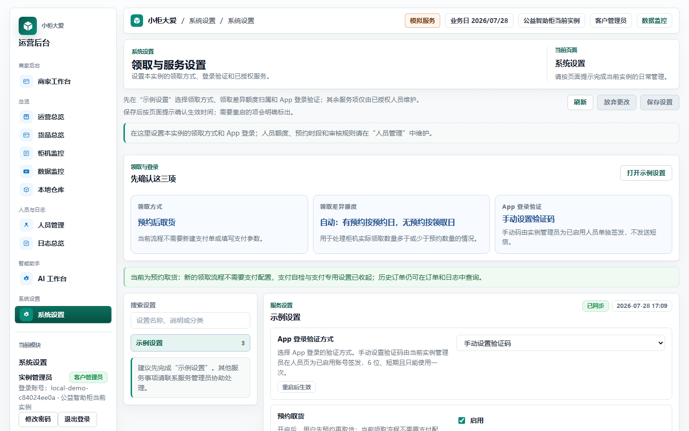
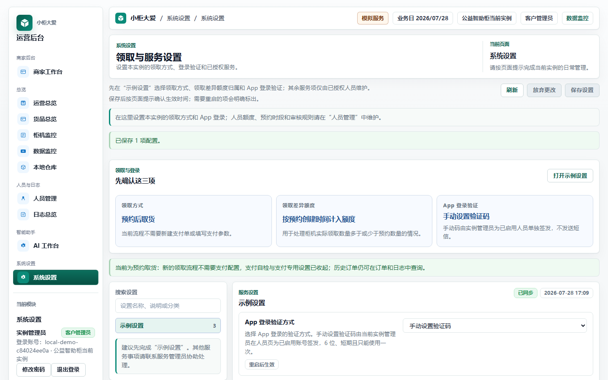
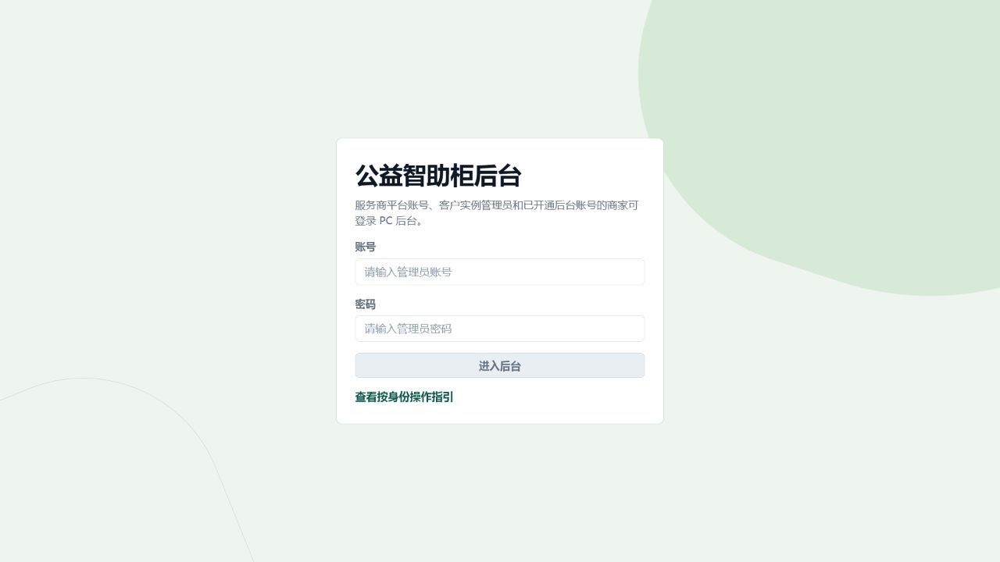
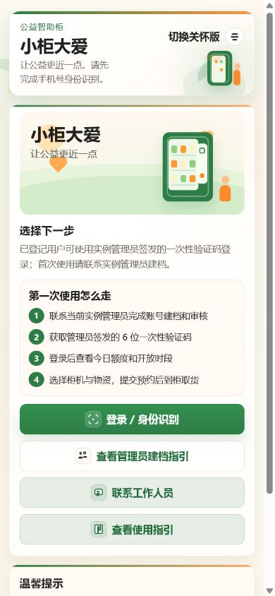
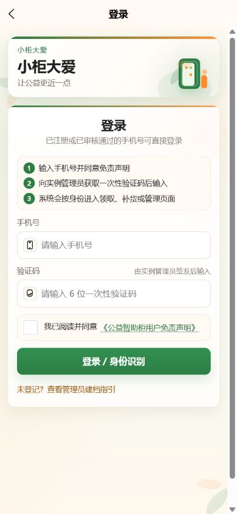
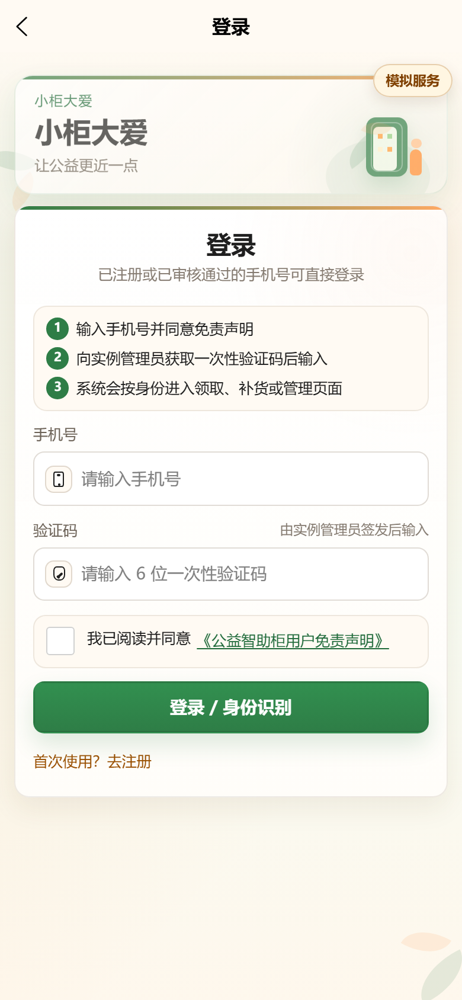
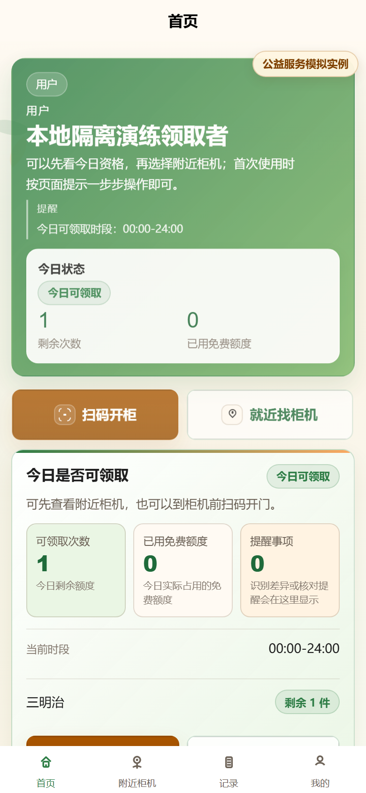
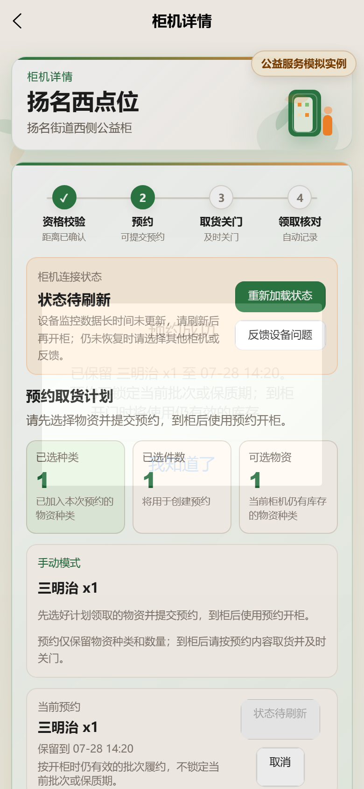
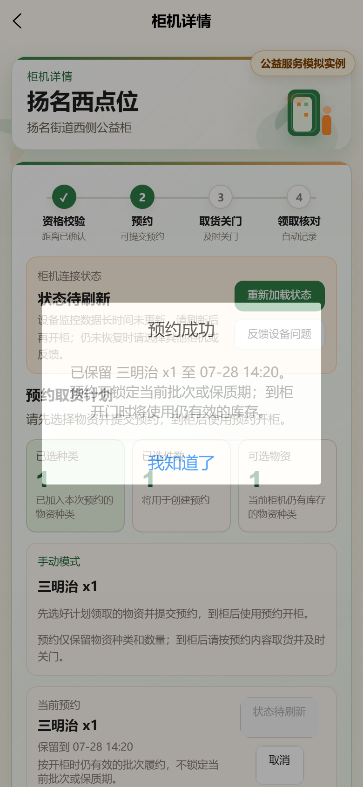
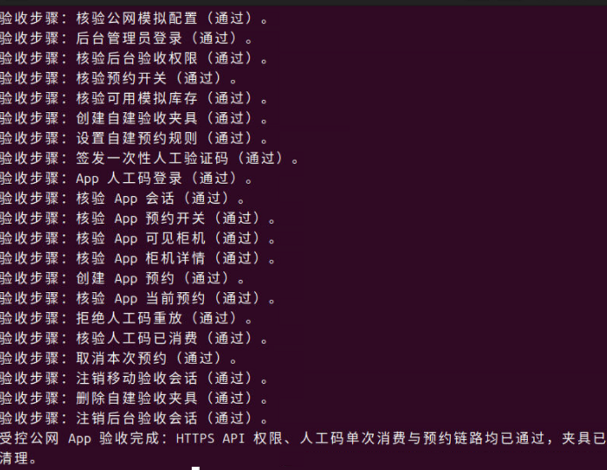

# 系统设置与 App 使用说明

本说明面向当前实例管理员，说明领取设置、一次性验证码和 App 预约取货的日常操作。

## 1. 先使用“示例设置”

后台“系统设置”页的首个入口是“示例设置”。日常操作先确认领取方式和额度归属；当前实例显示 App 登录验证方式时，再确认该项：

| 项目 | 推荐值 | 作用 |
| --- | --- | --- |
| 预约取货 | 开启 | 用户必须先预约再取货；新的领取流程不创建支付单，也不需要填写支付配置。 |
| 领取差异的额度归属 | 自动 | 柜机实际领取数量与预约不一致时，有预约按预约日计入额度，无预约按实际领取日计入额度。 |
| App 登录验证方式（页面显示时） | 手动设置验证码 | 实例管理员为已启用人员单独签发 6 位、一次性的登录验证码，可选择 10 分钟至 30 天有效期，不发送短信。 |

关闭“预约取货”后，系统进入即时领取流程，并显示支付相关设置；这不修改历史订单，也不等同于启用真实支付。

保存设置后，按页面提示确认是否需要重新启用服务；标有“重启后生效”的设置会在重新启用后用于新流程。

下图为本地隔离演练的后台设置页。

### 预约制开始前的三个条件

“示例设置”中的“预约取货”决定领取流程是否走预约、是否隐藏支付步骤；它不代替人员领取规则。开始 App 预约验收前，依次确认：

1. “示例设置”中的“预约取货”为开启。
2. “人员管理”中的预约规则已开启，并设置本次预约保留分钟数和超时上限。
3. 待验证人员是已启用的“特殊群体”人员，已绑定当日可领取物资模板或个人领取规则，且目标柜机仍有有效库存。

任一条件未满足时，一次性验证码登录仍可能成功，但 App 不会形成可用预约；这属于业务前置条件，不是验证码错误。

### 领取差异的额度归属怎么选

只有柜机实际领取数量与预约不一致时才会用到本项。日常验收建议保持“自动”；需要按特定业务日期核对时再选择其他项。

| 选项 | 适用场景 |
| --- | --- |
| 自动：有预约按预约日，无预约按领取日 | 默认选择；同一实例内同时存在预约与非预约记录时最容易核对。 |
| 按原领取时间计入额度 | 希望统一以本次领取业务创建时间统计额度。 |
| 按预约创建时间计入额度 | 希望预约当天即固定额度归属。 |
| 按柜机回传时间计入额度 | 以柜机实际回传到平台的时间作为额度归属依据。 |

下图记录了一次后台实际保存后的提示与更新后的额度归属。保存成功后，再按页面提示判断是否需要重新启用服务。

## 2. 不需要选择运行模板

系统只有“模拟服务”和“实机服务”两种运行方式，由服务管理员按部署统一设置。实例管理员不需要填写运行环境，也不需要匹配模板；日常只在“示例设置”中调整领取方式和额度归属。

“App 登录验证方式”只会在当前演练实例需要管理员选择时显示。未显示时，当前登录验证方式由服务管理员维护；不要为了显示该项自行修改运行方式。

## 3. 一次性验证码登录 App

一次性验证码只用于当前实例内、已启用人员的 App / 小程序登录或本人密码重置，不用于电脑后台 `admin` 账号登录。

如果知道当前 `admin` 后台密码，优先正常登录，再在侧栏“修改密码”中输入当前密码和两次新密码；只有验证通过才会更新密码。需要在 Spark VNC 本机维护时，同一维护命令也会先非回显验证当前密码，验证失败不写入也不会索取新密码，验证通过后才允许改密。唯一 `admin` 允许使用 6 位新密码，其他后台账号仍保持至少 8 位。不要把 App 一次性验证码用于后台登录；只有忘记后台密码时才按[发布与公网部署验证流程](发布与公网部署验证流程.md)中的恢复流程处理。

1. 使用实例管理员账号进入后台，打开“人员管理”。
2. 确认待验证人员已存在、已启用且属于当前实例；没有人员时先新建“特殊群体”人员并保存。
3. 为该人员绑定当日可领取物资模板，或新增一条个人领取规则；规则必须覆盖当前时间、至少一种柜内有库存的物资和本次所需数量。
4. 确认预约规则已开启，再在该人员的操作中点击“签发验证码”。
5. 用途选择“APP / 小程序登录”，在“6 位验证码”中输入本次验收码，设置 60–600 秒的有效期，然后签发。
6. 打开 App 登录页，填写该人员手机号、验证码，勾选免责声明后登录；登录成功后确认进入“特殊群体”首页。
7. 在 App 选择可领取柜机和物资，点击“提交预约取货”，确认预约保留时间和物资清单已出现。
8. 到柜时进入同一台柜机详情，核对预约内容后使用“用预约开柜”。柜门关闭后，App 应显示“预约取货完成”或“领取待核对”；两种结果均不发起支付，后者由管理员核对。
9. 回到后台的一次性验证码记录，首次登录所用记录应为“已使用”。用同一验证码再次登录，必须被拒绝；这验证了单次消费保护。

本次验收码只在受控签发页面输入，不写入环境变量、命令、日志或本说明。验证码过期、撤销、输错达到上限或首次成功使用后，都必须重新签发。

不操作真实柜机的安全验收可止于第 7 步：记录预约已创建、预约保留时间和“用预约开柜”前的确认页。第 8 步仅在已获柜机操作授权、现场条件满足且不影响实际服务时执行。

## 4. 角色权限速查

下表用于确认“谁该进入哪一类页面”。所有业务操作都受当前实例和已分配柜机范围约束，不能通过前端地址绕过。

| 角色 | 主要入口和可做的事 | 不应看到或执行的内容 |
| --- | --- | --- |
| 服务提供商 | 平台入口；创建、查看、进入或退出客户实例，查看平台级审计。 | 未进入实例时不直接读取或修改实例业务数据。 |
| 实例管理员 | 当前实例后台；维护人员、角色账号、一次性验证码、柜机、库存、规则、日志和已授权设置。 | 创建或切换其他客户实例；读取其他实例数据或原始服务密钥。 |
| 商户 | 商户工作台；维护自己的货品投放、补货模板和业务去向。 | 其他商户数据、其他实例数据和未分配柜机。 |
| 补货员 | 被分配柜机的补货与现场处理入口。 | 人员、账号、一次性验证码、系统设置和未分配柜机。 |
| 特殊群体用户 | App / 小程序；完成登记、预约取货、领取记录查看。 | 电脑后台和其他人员的业务资料。 |

角色新建、柜机分配与复核步骤见[实例后台使用手册](实例后台使用手册.md)。

## 5. 登录页操作示意

下列图片均未输入账号、密码、手机号或验证码。后台匿名登录页与 App 身份识别页已于 2026-07-29 从公网 HTTPS 入口重新采集；第 6 节的认证后页面图片仍是本地隔离演练。2026-07-29 已通过受控公网验收器完成认证后的 HTTPS API 流程，但本地图片不能替代认证后公网页面的脱敏视觉截图。

后台登录页：

App 首次使用页按 390×844 手机视口从公网采集：

点击“登录 / 身份识别”后，公网表单明确要求手机号、管理员签发的 6 位一次性验证码和免责声明；页面没有短信发送入口：

## 6. App：从一次性验证码到预约的完整流程

以下四张图来自 2026-07-28 的本地隔离演练。人员、验证码和会话均为本次临时生成，演练结束后已清理；未操作真实柜机，也不替代当前公网实例的管理员登录记录。2026-07-29 的受控公网验收已对同一 API 流程完成真实验证，见第 7.2 节；本节图片用于逐步解释登录后应看到的界面和操作顺序。

演练通过的顺序是：后台保存预约规则 → 为已启用人员签发一次性验证码 → App 勾选免责声明并登录 → 选择物资、创建预约 → 确认“当前预约” → 同一验证码重放被 API 以 `401` 拒绝 → 后台记录显示“已使用”。图片中不含手机号、验证码或后台密码。

1. 手动验证码入口：页面提示向实例管理员获取一次性验证码；输入框为 6 位，且没有短信“获取验证码”按钮。

2. 登录成功后进入用户身份首页，可以看到当天的领取资格和附近柜机入口。

3. 在柜机详情选择物资并提交后，会显示“预约成功”；预约流程不显示支付步骤。

4. 关闭确认框后，页面保留“当前预约”、保留时间和“用预约开柜”前的状态。演练在此停止，不执行开柜。

## 7. 公网管理员最终截图清单

登录页与本地隔离演练截图已经具备。2026-07-29 的受控公网验收器已依次通过人工码签发、App 登录、会话核验、预约创建、当前预约、人工码重放拒绝、人工码已消费、预约取消、会话注销和夹具清理；该结果证明公网 HTTPS API 链路已闭环。认证后的公网截图仍只能在当前实例管理员的安全登录会话中补齐，必须遮住手机号和验证码。以下清单是最终上线前的视觉核对项，不得用本地演练替代：

| 截图 | 应看到的结果 |
| --- | --- |
| 后台登录与实例工作台 | 实例管理员进入当前实例，而不是服务提供商跨实例页面。 |
| 系统设置：示例设置 | 预约取货、领取差异额度归属和四种额度归属选项均可见且可读。当前演练实例显示 App 登录验证方式时，确认其为手动设置验证码。 |
| 人员管理：预约规则与领取策略 | 预约规则已开启；待验证人员有当天可用的物资模板或个人领取规则。 |
| 人员管理：一次性验证码签发 | 已启用人员、用途、6 位输入框、有效期和签发按钮均可操作；截图不展示手机号或验证码。 |
| App 登录页（手机宽度） | 手机号、验证码、免责声明、登录按钮无横向溢出或遮挡。 |
| App 登录成功与预约确认页 | 登录后进入对应角色首页；选择柜机和物资后可看到“提交预约取货”及预约确认信息。 |
| App 预约结果页 | 显示“预约取货完成”或“领取待核对”，不出现支付步骤。 |
| 后台一次性验证码记录 | 同一条验证码显示“已使用”，重放被拒绝。 |

### 7.1 Spark 本机的受控公网闭环验收

受控公网验收入口固定为 `sudo /usr/local/sbin/vending-public-app-acceptance-root`。它不是公开接口，也不会绕过登录：只有固定的 Spark 服务用户能在经核验的本地图形终端零参数启动，不接受命令行参数或环境变量传入账号、密码、手机号、验证码、令牌或柜机编号。该入口须先按 [运行器安装说明](../deploy/public-app-acceptance/README.md) 从 root-owned、已核验的 Git checkout 安装；未完成 Git-only 发布与 root-only 安装时，仓库内的源码不能作为生产口令入口运行。

启动后会先通过固定的公网 HTTPS 业务入口核验以下条件：当前为模拟数据平面、App 使用人工验证码、验证码预览关闭、预约已开启，并且当前实例有一台在线且有可预约库存的柜机。任一项不成立时立即停止，尚未创建任何验收数据。

前置条件通过后，终端只以不回显方式读取后台管理员密码和本次 6 位人工验证码。运行器自行生成一次性的测试手机号且不会显示，然后按正式接口完成：创建特殊群体夹具 → 配置仅该夹具可用的临时预约规则 → 签发人工码 → App 登录 → 创建预约 → 验证同一码重放被拒绝 → 取消预约 → 注销移动与后台会话 → 删除夹具。

此过程不会修改系统设置、库存、柜机、支付或环境配置，也不会执行开柜。只有全部清理步骤成功时才会删除本次人员、预约和规则；若取消预约或网络响应未被确认，运行器会保留夹具并以失败退出，必要时只输出非敏感运行参考号供管理员在后台收尾。操作审计、已取消预约等业务留痕按系统规则保留；生成的测试手机号不会回显、写入命令、环境变量或运行器输出。受控接口失败时终端仅额外显示 HTTP 状态，不显示服务端原文。该工具仅证明 HTTPS API 的权限、人工码单次消费和预约链路，不替代第 5–6 节的首页、后台页、手机界面视觉验收或带端口入口回归。

### 7.2 已归档的真实功能流程证据

下图来自 2026-07-29 的 Spark 本机受控公网验收。它逐项显示预检、后台权限、人工码登录、App 会话、预约创建、当前预约、重放拒绝、人工码已消费、取消预约、会话注销与夹具清理全部通过。图中不含账号、密码、手机号、验证码、令牌或环境配置，因此可作为功能闭环证据；认证后手机页面的脱敏视觉截图仍按本章清单单独采集。

## 8. 常见情况与处理

| 看到的情况 | 先检查什么 | 正确处理 |
| --- | --- | --- |
| App 提示验证码不正确或已失效 | 人员是否为当前实例已启用人员；验证码是否过期、撤销、输错达到上限或已经使用。 | 不重复猜测；由实例管理员重新签发一条短期验证码。 |
| App 已登录但不能提交预约 | “示例设置”的预约取货、人员预约规则、当前时段领取策略和柜机库存。 | 按“预约制开始前的三个条件”逐项补齐后重新进入柜机详情。 |
| App 没有“获取验证码”按钮 | 当前实例是否显示并选择了“手动设置验证码”。 | 这是预期界面；向实例管理员获取一次性验证码，不发送短信。 |
| 预约流程没有支付设置或支付步骤 | “预约取货”是否开启。 | 这是预约制的预期行为；不要为了继续预约而填写支付配置。 |
| 同一验证码第二次登录被拒绝 | 后台一次性验证码记录是否显示“已使用”。 | 这是单次消费保护；重新签发新码，旧码不能恢复。 |

## 9. 需要服务支持时

短信、地图、柜机和非预约支付等服务由服务管理员统一处理。日常操作先使用“示例设置”；地图暂不可用时可以先手工录入坐标，再联系工作人员协助。

账号、角色和柜机分配的详细操作见[实例后台使用手册](实例后台使用手册.md)。

预约取货开启时，支付专用设置和支付自检会在界面中收起。历史订单、退款和操作日志的查询能力仍保留，但不应把历史资料当作新领取流程的配置前提。
